**A Top-Level View of Computer Function and Interconnection**
---
<!-- TOC -->

- [1. 计算机顶层概述](#1-计算机顶层概述)
- [2. 计算机组件](#2-计算机组件)
    - [2.1. 问题](#21-问题)
    - [2.2. 内存组件(Memory)](#22-内存组件memory)
        - [2.2.1. cache(高速缓存器)](#221-cache高速缓存器)
        - [2.2.2. Constraints(约束)](#222-constraints约束)
    - [2.3. I/O](#23-io)
    - [2.4. CPU](#24-cpu)
        - [2.4.1. 问题](#241-问题)
        - [2.4.2. 问题解决](#242-问题解决)
        - [2.4.3. 问题的再次产生](#243-问题的再次产生)
        - [2.4.4. 其他的问题](#244-其他的问题)
    - [2.5. Bus总线](#25-bus总线)
        - [2.5.1. Interconnection solution 内部通路的解决方案](#251-interconnection-solution-内部通路的解决方案)
    - [2.6. 总线转换类型](#26-总线转换类型)

<!-- /TOC -->

# 1. 计算机顶层概述

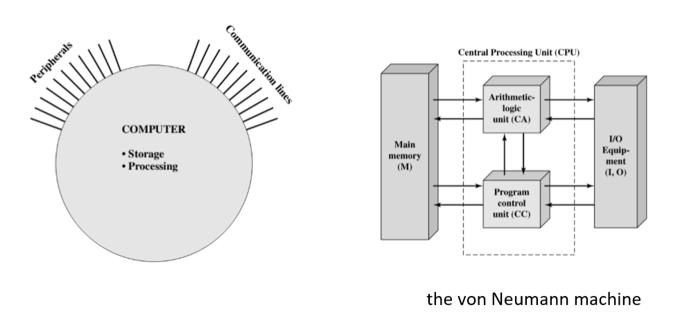

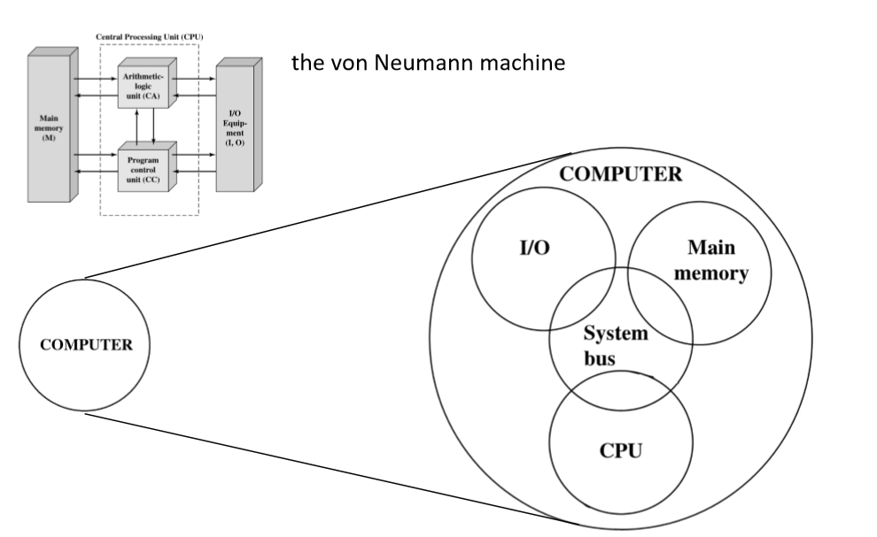

# 2. 计算机组件
1. 计算机访问时储存在哪来访问，取出来是什么就是什么。
2. 因为指令和数据都是按照二进制进行储存，所以只能用存储地址来决定是什么这个问题。
3. 不关心具体是什么，而关心怎么做。

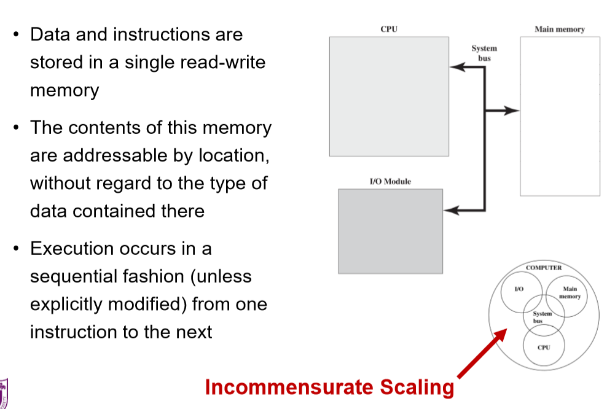

4. 总线:System bus,来进行传输。

## 2.1. 问题
1. 我们在追求性能的时候，每一个部件发展的过程是一个非常不平衡的过程。
2. 所以在接下来的发展过程，不同部件之间可能会存在难以协调的问题。
    + 我们会尽量将性能比较好的部件进行使用。
    + 因为协调不同组件之间的性能差异，会出现不同的很多技术。

## 2.2. 内存组件(Memory)
1. 按照地址进行访问。

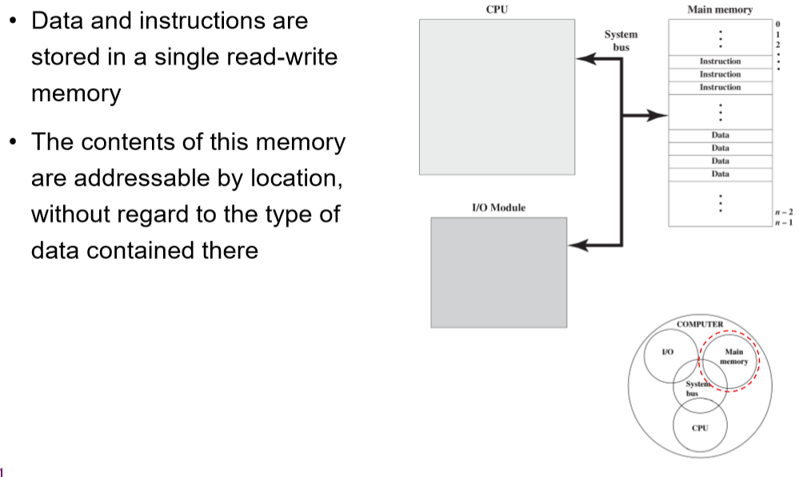

2. 问题产生:逻辑运算速度和内存存取速度之间的差异。(CPU的速度和内存的速度的不一致)
    + Memory Wall:内存墙。
    + 为什么CPU不可以不管内存的速度慢？根本上是因为CPU处理的指令和数据，如果不能从内存中拿到数据就什么也干不了。

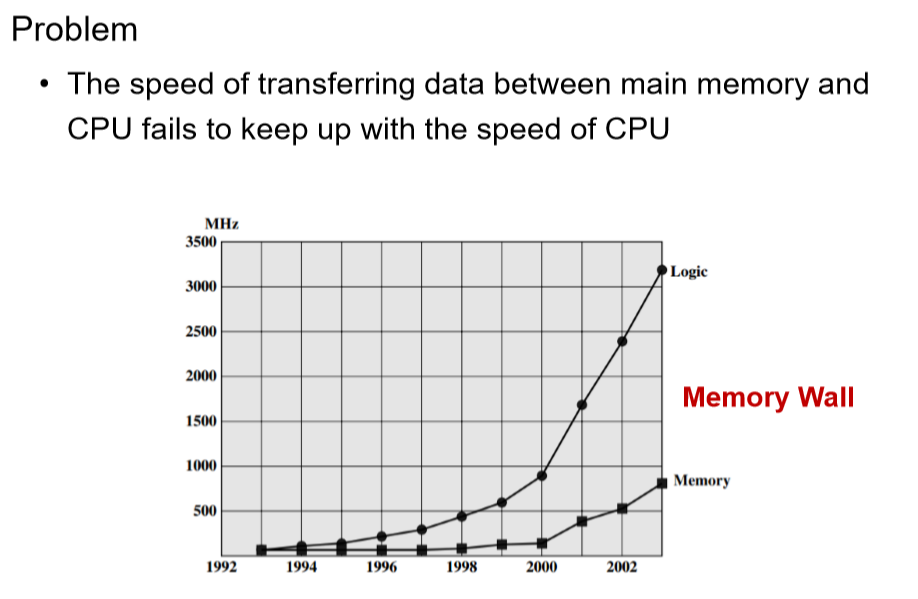

3. 问题解决:
    1. 添加一个cache或者其他缓存设备来减少频繁的内存访问并提高数据传输速度。Add a cache or other buffering scheme to reduce the frequency of memory access and increase data transfer rate
    2. 增加一次性能够取回的数据的位数。Increase the number of bits retrieved one-time

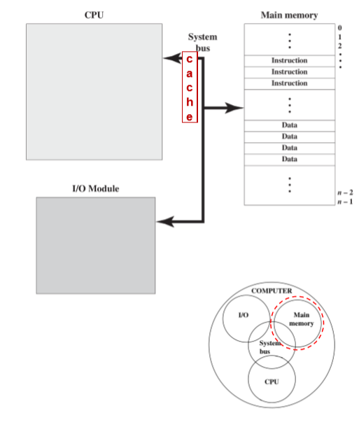

memory hierarchy(存储层次)
---
1. 我们会发现容量大、速度快的存储单元的价格会比较高，所以设置了层次结构。
2. 所以我们按照量大小排成了金字塔。
3. 从06年金字塔开始变化，逐渐变矮。
    + 因为速度和存储都可以变得很好。

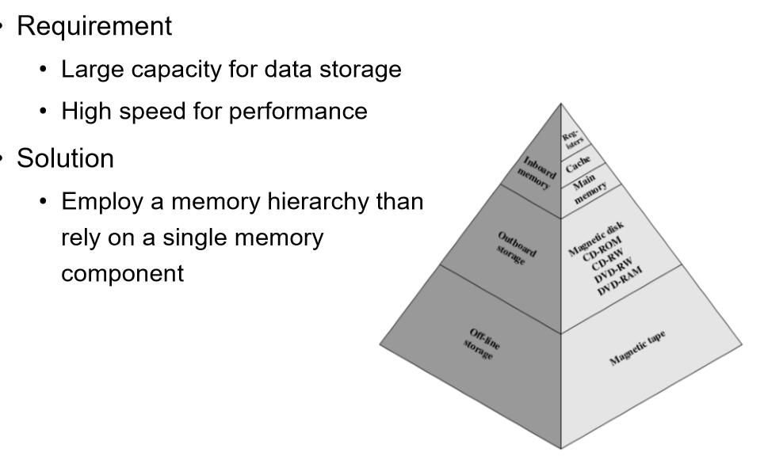

### 2.2.1. cache(高速缓存器)
1. 很小的一部分，但是运行速度很快。
2. 究竟存了什么可以让速度快了这么多？

### 2.2.2. Constraints(约束)
1. Capacity: larger is better(更大)
2. Speed: keep up with the processor(和处理器速度匹配)
3. Cost: reasonable to other components(和其他部件相比比较合理)
4. Relationship between constraints        
    + Shorter access time, greater cost per bit(更短的访问时间，每位更高的访问代价)

## 2.3. I/O
1. Exchange data gathered from external sources with CPU and memory(外部设备和CPU以及储存之间的数据交换)

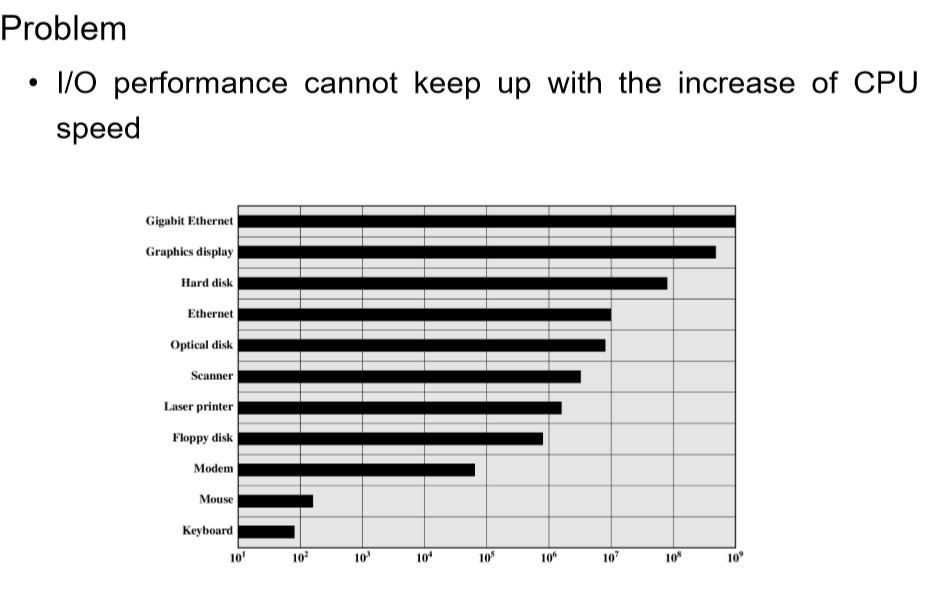

2. 问题:如果计算机可以处理最快的部分，那么慢的部分的空闲时间如何处理？
    + 为什么会有这个问题？因为输入比较慢，CPU会有大量的闲置时间。
    + 如果让CPU及时发现终端?每次处理过程中，在处理完后去查询是否有中断。
3. 问题解决:
    1. Buffering:如果是一个时间段突然很多。
        + 为什么？可能一瞬间的数据量比较大，我们来不及处理可能需要缓冲，特别慢也需要缓冲，防止过多的终端同时发送数据导致的数据溢出。
    2. New interface techniques(新设备接口)
3. 中断的时候中断怎么办？
    + 禁止中断。
    + 设置中断级别。

## 2.4. CPU

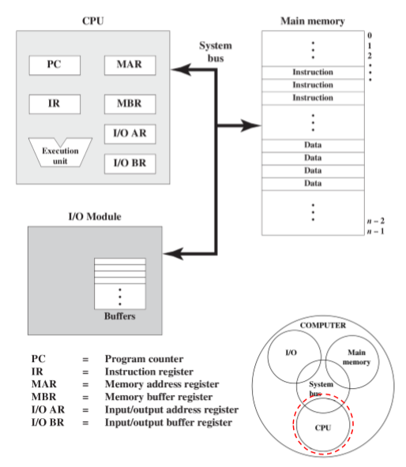

1. Execution occurs in a sequential fashion (unless explicitly modified) from one instruction to the next(从一条指令到下一条指令的执行是按顺序进行的（除非显式修改))
2. Data and instructions are stored in a single read-write memory(数据和指令存储在单个读写存储器中)
3. The contents of this memory are addressable by location, without regard to the type of data contained there(此内存的内容可按位置寻址，而不考虑其中包含的数据类型)
4. 寄存器来进行储存。

### 2.4.1. 问题
1. 速度过快，在没有事情的时候会进行闲置。
2. Interrupt: a mechanism by which other modules (e.g. I/O) may interrupt normal sequence of processing(一些机器可能会打断CPU的正常处理顺序)

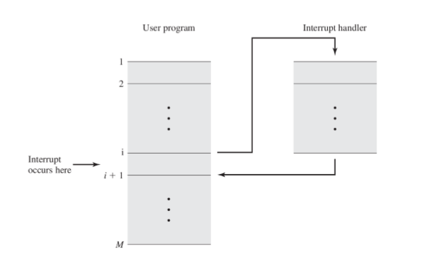

3. 不在一直等待你进行输入，而是同时在等待输入和干别的事情。
    + 如何及时知道你敲下了一个字？:把你输入一个字作为一个中断。

### 2.4.2. 问题解决
1. 循环过程:

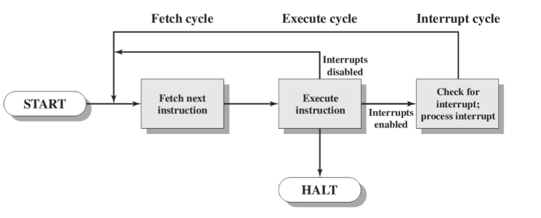

2. 每个指令执行完之后，都会查看有没有中断，轮询。

### 2.4.3. 问题的再次产生
1. 很多种中断，在中断过程中，出现一个中断。(Nested 嵌套 interrupt processing)
2. 例子:学习作为主线程，第一次王者中断，第二次中断。
3. 不同中断的级别是不同的，不同级别不同响应。

### 2.4.4. 其他的问题

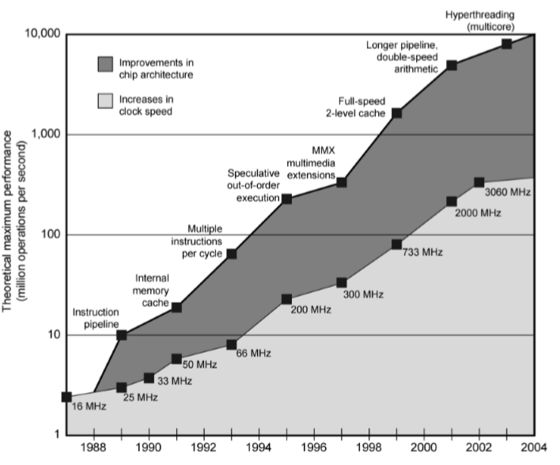

1. 依然会让速度提升。

## 2.5. Bus总线

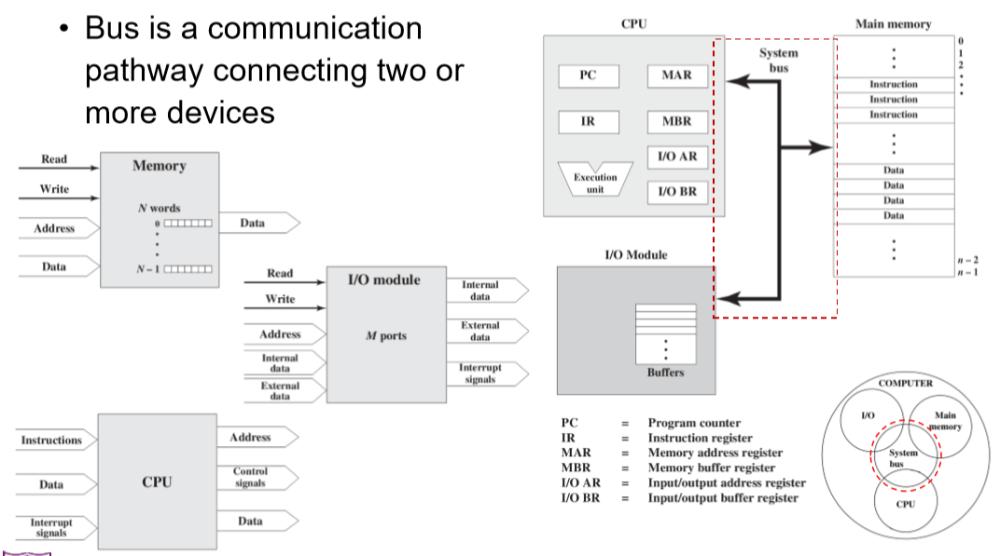

1. Bus is a communication pathway connecting two or more devices(总线是两个或者以上的设备连接的沟通路径)
2. CPU包含处理器和控制器。

### 2.5.1. Interconnection solution 内部通路的解决方案

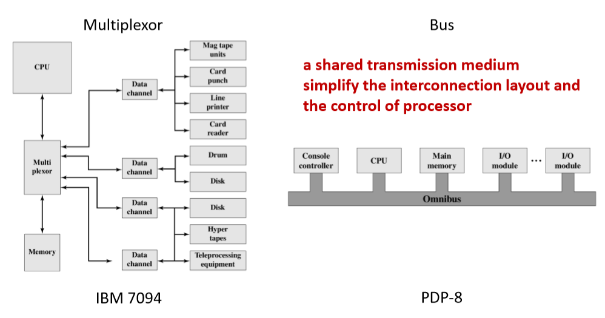

1. 路(总线)不是专门为一个设备而使用的。
2. 很多设备连接在总线上，无论是信息归属还是信息阻塞，都是问题。

## 2.6. 总线转换类型
1. 地址和数据的线是可以复用的
    + 读数据是先送地址，再取数据。
2. **总线类型**:Any bus lines can be classified into three functional groups(任意总线都可以被划分成三种)
    + Data lines: move data between system modules(数据总线:在系统中传递数据)
    + Address lines: designate the source or destination of the data on the data bus and address I/O ports(地址总线:指定数据总线上数据的源或目标以及地址I/O端口)
    + Control lines: control the access to and the use of the data and address lines(控制总线:控制访问权限以及对于数据总线和地址总线的访问权限)
3. 数据和地址线可以合并在一起，但是不可以和控制线合并在一起。

3. 但是在写入的时候，写入过多会受到影响。而读出过多不会被影响。
