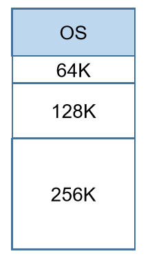
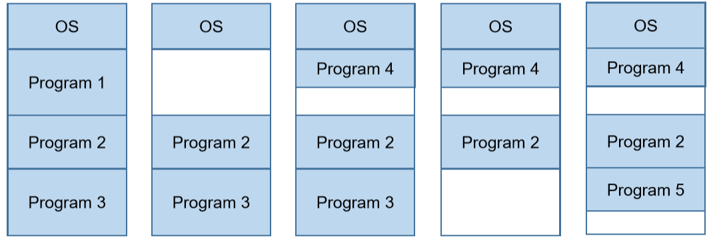
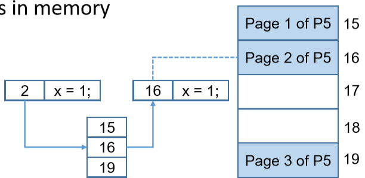
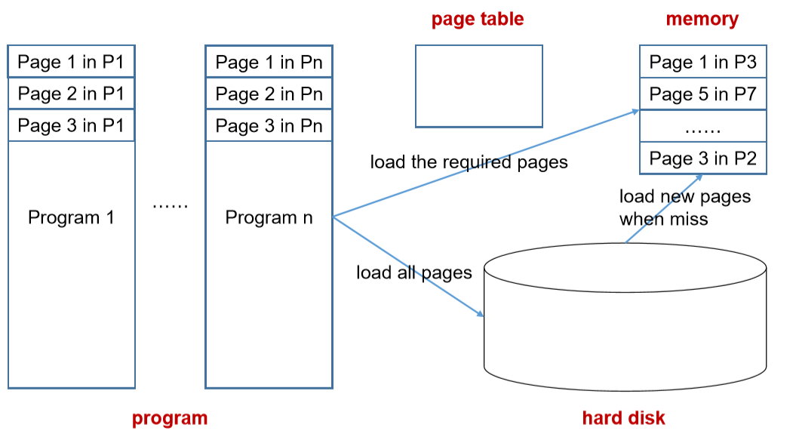
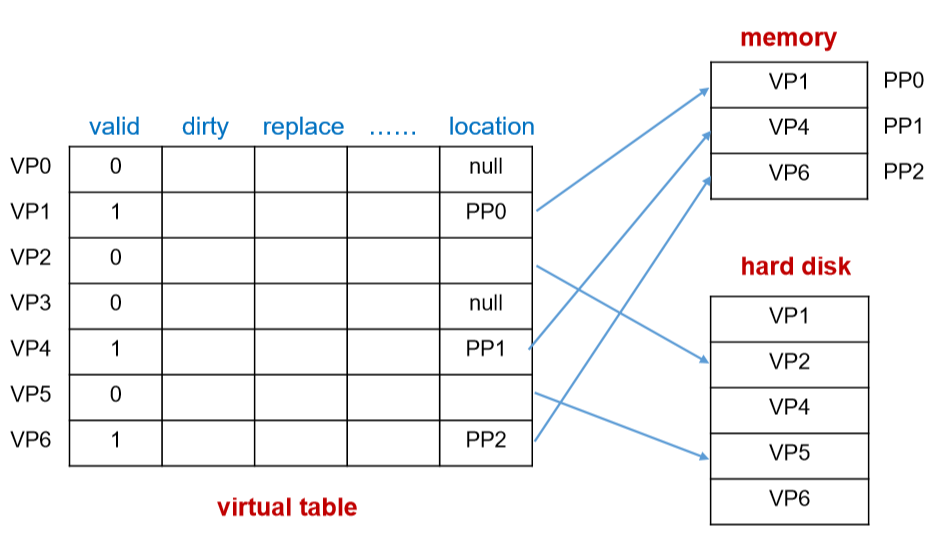
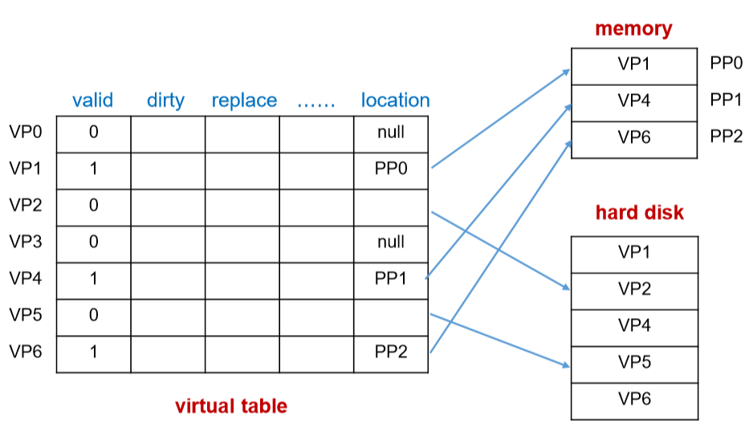
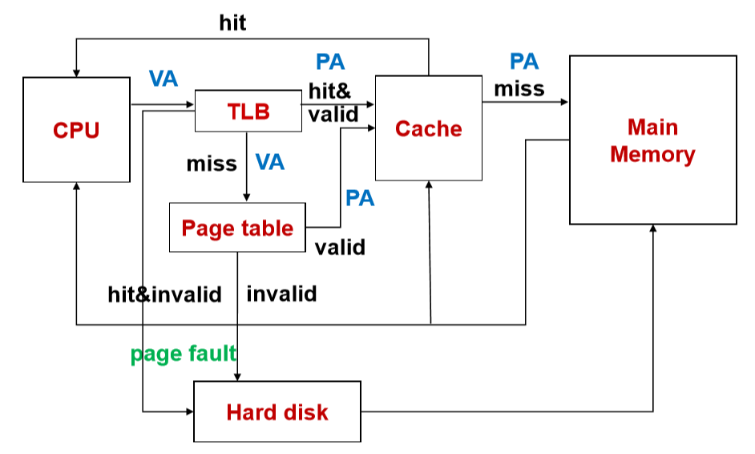
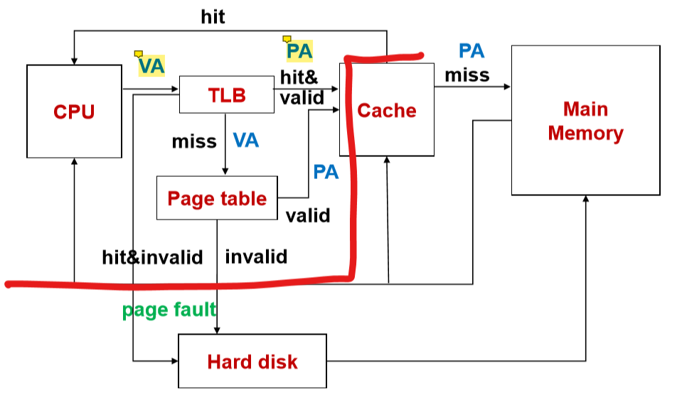
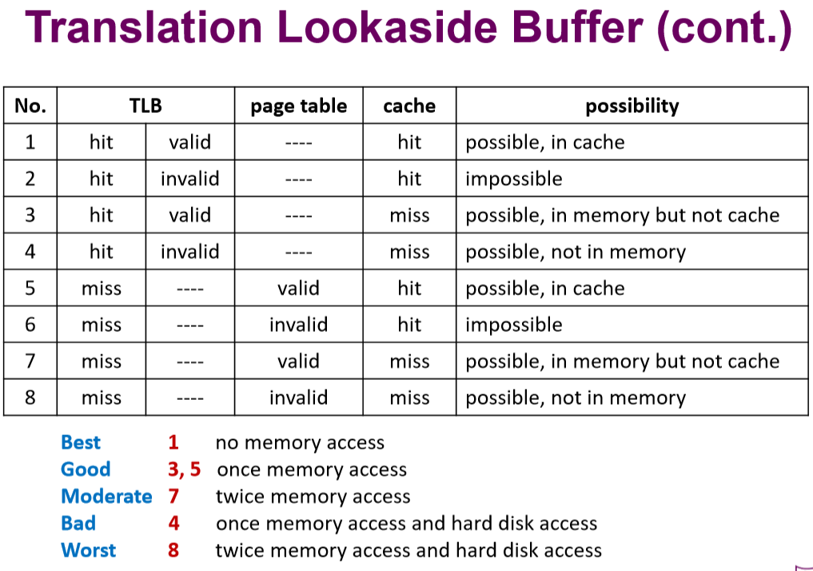
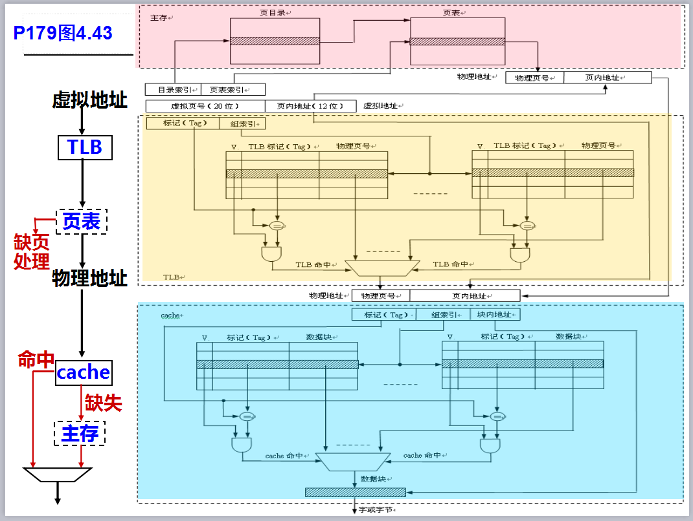

Virtual Memory
---
<!-- TOC -->

- [1. 内存管理](#1-内存管理)
- [2. 加载更多程序的解决方案](#2-加载更多程序的解决方案)
- [3. 分区(Partitioning)](#3-分区partitioning)
  - [3.1. Fixed-size partition(确定的分区策略)](#31-fixed-size-partition确定的分区策略)
  - [3.2. Variable-length partition(可变长的分区策略)](#32-variable-length-partition可变长的分区策略)
- [4. 分页(Paging)](#4-分页paging)
- [5. Virtual Memory(虚拟内存)](#5-virtual-memory虚拟内存)
  - [5.1. 虚拟内存示例](#51-虚拟内存示例)
  - [5.2. 虚拟内存问题](#52-虚拟内存问题)
    - [5.2.1. Page based Virtual Memory(基于分页的虚拟内存)](#521-page-based-virtual-memory基于分页的虚拟内存)
    - [5.2.2. Translation Lookaside Buffer(快表，TLB)](#522-translation-lookaside-buffer快表tlb)
    - [5.2.3. Segment based Virtual Memory(基于分段的虚拟内存)](#523-segment-based-virtual-memory基于分段的虚拟内存)
    - [5.2.4. Segment and Page based Virtual Memory(基于分段和分页的虚拟内存)](#524-segment-and-page-based-virtual-memory基于分段和分页的虚拟内存)
- [6. 编程作业的一些概念](#6-编程作业的一些概念)

<!-- /TOC -->

# 1. 内存管理
1. In the past, only OS and one program are in memory(过去只有操作系统和一个程序会使用内存)
2. Currently, OS and multiple programs are in memory(现在，操作系统和多个程序使用内存)
    + To avoid the idle of processor when the programs wait for I/O, it requires to load more programs in memory(为了避免程序在等待I/O的时候的处理器的空闲，处理器需要加载很多的程序进入内存)
3. Memory management(内存管理)
    + In multiprogramming system, the “user part” of memory should be further partitioned to fit multiple programs, which is dynamically carried out by OS(在多道程序设计系统中，内存的“用户部分”需要进一步划分以适应由操作系统动态执行的多个程序)
    + Don’t consider “process” in this slide(在本节中不要考虑“过程”)

# 2. 加载更多程序的解决方案
1. Enlarge memory(增大内存)
2. Using exchange and overlap techniques(使用交换和重叠技术)
    + When no program is ready, OS loads other programs in(如果一个程序还没有准备好，操作系统加载另一个程序进来)
    + Partitioning and paging(分区和分页)
3. Virtual memory(虚拟内存)
    + Demand paging(按需分页)
    + Virtual address(虚拟地址)

# 3. 分区(Partitioning)
1. 什么是分区?

## 3.1. Fixed-size partition(确定的分区策略)

1. OS: fixed size(确定大小)
2. User program: fixed size with different lengths(确定的不同长度的程序)
    + When load a program, put it in the smallest partition which has enough length(当加载一个程序的时候，把这个程序加载进入长度足够的最小的页里)
3. Drawback(缺点): waste of memory(浪费内存)
4. 操作系统如何**分配分区**？(**重要**)
    1. 选择一个目前是空的
    2. 能够放的下的
    3. 最小的

## 3.2. Variable-length partition(可变长的分区策略)
1. OS: fixed size(操作系统:定长)
2. User program: as requirement(用户程序:按需)
3. Drawback: the number of fragments increases
(碎片数量会增加)

# 4. 分页(Paging)

1. Basic idea
    + Divide the memory into fixed-size blocks, named **page frame**, and divide the program into fixed size blocks, named **page**(将内存分为一个个叫做**页框**的固定长度的块，然后将程序分为可以放进块的叫做**页**的部分)
    + Load the pages into page frames(把页加载到页框里去)
2. Logical address: address in instruction(逻辑地址:指令中的地址)
3. Physical address: address in memory(物理底子:内存中的地址)
4. 程序叫做页，放程序的地点叫做页框
    + 页放在哪里由OS决定，在我们的程序中写的是逻辑地址，由操作系统的决定物理地址。
    + 页放进去并不是连续的放入，记录页存在的位置
5. 分页:将内存分成固定大小的页框，将需要存储成页，寻找空的页框放入(空的即可，因为一样大)，这样做会导致程序的不连续性，但是有页表来记录地址。

# 5. Virtual Memory(虚拟内存)
1. Problem
    + The size of memory is limited, but the requirement of memory keeps increasing(内存的大小是有限的，但是对于内存的需求在不断的增加)
2. Basic idea
    + Demand paging: only load the active pages in paging(按需分页:只需要加载目前活跃的页)
    + 用不到页就暂时不放进来。
3. Essence(本质)
    + Programming in a logical address space larger than memory(在大于内存空间的逻辑空间进行编程)
    + Only load the required programs and data in memory(只在内存中加载需要的程序和数据)
    + Transfer the logical address to physical address by hardware(通过硬件来转换逻辑地址成物理地址)
    + Exchange information between memory and hard disk when miss(当发生了未命中的时候，我们在内存和硬件之间交换信息)

## 5.1. 虚拟内存示例

1. 先把程序加载到硬盘的特定区域，然后我们什么时候需要这个内存，我们移动到memory中去。
2. 存储是否被加载到物理内存中，如果被加载进入物理内存，则是物理地址。如果没有在里面则在Disk中
    + 如果已经满了，我们就使用替换策略进行替换。
3. 内存中有的，Disk中也是有的，因为是**拷贝**关系

## 5.2. 虚拟内存问题
1. Size of page
    + 4KB, 8KB, …
2. Mapping function(映射方式)
    + Associative mapping(全相联映射)
3. Types
    + Page based virtual memory(基于分页的虚拟内存)
    + Segment based virtual memory(基于分段的虚拟内存)
    + Segment and page based virtual memory(基于分段和分页的虚拟内存)
4. Write policy
    + Write back(写回策略)，直到被替换出来才修改Disk中的数据
5. 速度比例:
    1. Cache is 10 times faster than memory
    2. Memory is 100000 times faster than hard disk

### 5.2.1. Page based Virtual Memory(基于分页的虚拟内存)

1. Divide the main memory and virtual memory into pages with the same size(把主存和虚拟内存分成相同大小的页)
    + Virtual page (VP) / logical page: page in virtual memory(虚拟页，简称虚页)
    + Physical page (PP) / page frame: page in main memory(物理页，又叫页框)
2. Page table(页表)
    + A table contains the information of all **VPs**, including location(地址), valid bit(有效位，是否被加载到物理页中), dirty bit(脏位), r/w right et al.(页表中包含了所有的虚页，无论是否加载到主存中，都在页表中)
    + Store in main memory(存在主存中)
    + Virtual address(虚拟地址)
        + Virtual page number + offset in page(虚拟页的页号+页内偏移)
    + 每一个条目(虚拟页中):位置信息(物理页号、指向硬盘指针、null表示还没有被使用)、脏位(减少对磁盘的访问)、有效位(有无被加载到物理内存中)、读写权限

3. 如上是一个页表的实现
    + 如果虚页已经载入到了物理内存中，我们就要记录它的物理地址(location,valid = 1)
    + location没写的存储的是指向硬盘(虚拟内存中)的指针
    + **location == null:表示磁盘里面没有,而不是内存中没有**
    + 虚拟页号比物理页号要大一些，虚拟页号没必要存储，按照相应的物理页号位置来找虚拟页号的位置
4. 如果location的长度是不同的(null，物理页号，指针)
    + 我们必须按照最长的部分来等长存储，以免无法进行更换
5. 可以把页表放置到Cache中(但是是放置比较常用的页表的行)
6. 页式的虚拟内存比分页好在哪里?
    1. 程序员不需要考虑具体存储的物理地址。
    2. 程序员可以有一个独享的大的内存。

### 5.2.2. Translation Lookaside Buffer(快表，TLB)

1. The usage of page table increases the access of main memory(页表的使用增加了对主存的访问)
2. To reduce memory access, load the frequently used items in page table to cache(为了去减少对内存的访问，我们将**常用的页表的行**放置到cache中去，需要在前面加上一个标记表示第几行)
3. TLB: the page table items loaded in cache(加载到cache中的页表)
    + Associative mapping, set associative mapping(常用全相联映射和组相联映射)
    + Random replacement(随机替换策略)

4. 快表的实现流程图

5. 我们只要将虚拟页号(VA)根据页表(Page table)转换到物理页号(PA)中去
    + 前提:在物理内存中:如果hit的话，直接传入物理地址。如果miss的话，我们到页表中去访问
    + 如果hit并且是invalid的情况下，我们用硬盘把页送到内存中去，然后到cache正常访问。
6. 如果未在物理内存中的话，也就是发生了缺页操作，于是对于磁盘(虚拟内存)进行操作。(也就是invalid的状态)

1. cache是内存的拷贝
2. **TLB miss的情况下只是比hit的情况多一次内存访问**
3. **TLB、页表valid表示在内存中**

### 5.2.3. Segment based Virtual Memory(基于分段的虚拟内存)

1. Divide the program and data into segments with different lengths, and load the required segments into memory(将程序和数据分成不同长度的段，并将所需的段加载到内存中)
2. Virtual address(虚拟地址)
    + Segment number + offset in segment(虚拟的段的地址 + 段内的偏移量)
3. Compared to page base virtual memory(和基于分页的虚拟内存的对比)
    1. Page base virtual memory(基于分页的虚拟内存)
        + Advantage: simple, low cost(简单，代价低)
        + Disadvantage: instruction and data may cross pages(指令和数据可能会跨页)
    2. Segment based virtual memory(基于分段的虚拟内存)
        + Advantage: naturally divide program and data(自然地划分程序和数据)
        + Disadvantage: not fixed length(长度不确定)

### 5.2.4. Segment and Page based Virtual Memory(基于分段和分页的虚拟内存)
1. Divide the program and data into segments, and further divide the segments into pages(将程序和数据分段，然后将每一段在分到每一个页中去)
    + Each segment has its page table(每一个段都有自己的页表)
2. Virtual address(虚拟内存)
    + Segment number + page number + offset in page(段号+页号+页内偏移量)
3. Advantage
    + Program is shared and protected in segment(程序被保护和分开在段内)
4. Disadvantage
    + Required multiple times table search(需要使用很多次表来进行搜素)

# 6. 编程作业的一些概念
1. 实模式:没有使用虚拟内存。(效率高)
    + 也就是给你的地址就是实际地址。
2. 段:是一个虚拟内存
    + 段内是有权限的保护。
    + 访问页的时候是一样大的，但是访问段的时候是可大可小的。
    + 段是由越界风险的。
    + 段是起始位置(base)+长度(length)，如果出现越界，则按照异常来进行处理
    + 具体要读的位置是base+偏移量
3. 段页式:
    + 把本来连续的段拆成几个页。
    + 也就是要为每一个段建一个页表。
    + 也就是有段表和每一个段的页表。