WInstruction Sets
---
<!-- TOC -->

- [1. Computer Function 计算机功能](#1-computer-function-计算机功能)
- [2. 指令](#2-指令)
  - [2.1. Instruction Cycle(指令周期)](#21-instruction-cycle指令周期)
    - [2.1.1. Instruction cycle state diagram](#211-instruction-cycle-state-diagram)
  - [2.2. Instruction Cycle with Interrupts(含有中断的指令周期)](#22-instruction-cycle-with-interrupts含有中断的指令周期)
- [3. Instruction(指令)](#3-instruction指令)
  - [3.1. Elements of instruction(指令包含元素)](#31-elements-of-instruction指令包含元素)
  - [3.2. Instruction representation 指令表示](#32-instruction-representation-指令表示)
- [4. Operations](#4-operations)
  - [4.1. Data transfer(数据传输)](#41-data-transfer数据传输)
  - [4.2. Arithmetic(运算)](#42-arithmetic运算)
  - [4.3. Logical(逻辑)](#43-logical逻辑)
  - [4.4. Conversion(转换)](#44-conversion转换)
  - [4.5. I/O 输入输出](#45-io-输入输出)
  - [4.6. Transfer of control 控制转换](#46-transfer-of-control-控制转换)
    - [4.6.1. Branch / Jump:分支/跳转](#461-branch--jump分支跳转)
    - [4.6.2. Skip:跳过](#462-skip跳过)
    - [4.6.3. Procedure call:调用过程](#463-procedure-call调用过程)
- [5. Operands(操作数)](#5-operands操作数)
  - [5.1. Address(地址)](#51-address地址)
    - [5.1.1. 减少地址个数](#511-减少地址个数)
  - [5.2. Numbers(数字)](#52-numbers数字)
  - [5.3. Characters(字符)](#53-characters字符)
  - [5.4. Logical data(逻辑数据)](#54-logical-data逻辑数据)
  - [5.5. Big endian ordering and little endian ordering(大端模式和小端模式)](#55-big-endian-ordering-and-little-endian-ordering大端模式和小端模式)
    - [5.5.1. Big endian(大端)](#551-big-endian大端)
    - [5.5.2. Little endian(小端)](#552-little-endian小端)
- [6. Operand Reference Format(操作码引用的格式)](#6-operand-reference-format操作码引用的格式)
  - [6.1. Addressing Modes(寻址模式)](#61-addressing-modes寻址模式)
  - [6.2. Notation(符号约定)](#62-notation符号约定)
  - [6.3. Immediate Addressing(立即寻址)](#63-immediate-addressing立即寻址)
    - [6.3.1. Mode](#631-mode)
    - [6.3.2. Usage](#632-usage)
    - [6.3.3. Algorithm](#633-algorithm)
    - [6.3.4. Advantage](#634-advantage)
    - [6.3.5. Disadvantage](#635-disadvantage)
  - [6.4. Direct Addressing(直接寻址)](#64-direct-addressing直接寻址)
    - [6.4.1. Mode](#641-mode)
    - [6.4.2. Usage](#642-usage)
    - [6.4.3. Algorithm](#643-algorithm)
    - [6.4.4. Advantage](#644-advantage)
    - [6.4.5. Disadvantage](#645-disadvantage)
  - [6.5. Indirect Addressing(间接寻址)](#65-indirect-addressing间接寻址)
    - [6.5.1. Mode](#651-mode)
    - [6.5.2. Algorithm](#652-algorithm)
    - [6.5.3. Advantage](#653-advantage)
    - [6.5.4. Disadvantage](#654-disadvantage)
    - [6.5.5. Comment](#655-comment)
  - [6.6. Register Addressing(寄存器寻址)](#66-register-addressing寄存器寻址)
    - [6.6.1. Mode](#661-mode)
    - [6.6.2. Algorithm](#662-algorithm)
    - [6.6.3. Advantage](#663-advantage)
    - [6.6.4. Disadvantage](#664-disadvantage)
    - [6.6.5. Comment](#665-comment)
  - [6.7. Register Indirect Addressing(寄存器间接寻址)](#67-register-indirect-addressing寄存器间接寻址)
    - [6.7.1. Mode](#671-mode)
    - [6.7.2. Algorithm](#672-algorithm)
    - [6.7.3. Advantage](#673-advantage)
    - [6.7.4. Disadvantage](#674-disadvantage)
  - [6.8. Displacement Addressing(偏移寻址)](#68-displacement-addressing偏移寻址)
    - [6.8.1. Relative addressing(相对寻址)](#681-relative-addressing相对寻址)
    - [6.8.2. Base-register addressing(基址寻址)](#682-base-register-addressing基址寻址)
    - [6.8.3. Indexing(间址寻址)](#683-indexing间址寻址)
  - [6.9. Stack Addressing(栈寻址)](#69-stack-addressing栈寻址)
- [7. Instruction Set Design 指令集设计](#7-instruction-set-design-指令集设计)
- [8. Instruction Format(指令格式)](#8-instruction-format指令格式)
  - [8.1. Instruction Length(指令长度)](#81-instruction-length指令长度)
  - [8.2. Allocation of Bits(分配指令长度)](#82-allocation-of-bits分配指令长度)
  - [8.3. Variable-Length Instructions(可变长操作数)](#83-variable-length-instructions可变长操作数)
    - [8.3.1. Advantage](#831-advantage)
    - [8.3.2. Disadvantage](#832-disadvantage)
- [9. 问题](#9-问题)

<!-- /TOC -->

# 1. Computer Function 计算机功能
1. The basic function performed by a computer is execution of a program, which consists of a set of instructions stored in memory(计算机的基本功能就是能够执行在内存中存取的指令的集合来完成一个程序)
2. The processor does the actual work by executing instructions specified in the program(处理器被程序确定的可执行指令来完成实际的工作)

# 2. 指令
1. 指令是计算机处理的最基本单位
    + 操作码(指令执行的内容)+ 操作数(要操作的对象)
2. 多周期实现方案
    + 可以将一条指令的执行分解为一系列步骤
        + 取指令，译码/取寄存器，执行/有效地址/完成分支，访问内存，存储结果

## 2.1. Instruction Cycle(指令周期)
1. Instruction cycle: The processing required for a single instruction(指令周期:)
    1. Instruction fetch: fetch one instruction from memory each time(取指令:每次从内存中获取指令)
    2. Instruction execute: execute each instruction(指令执行:执行每一条指令)
2. Program execution halts only if the machine is turned off, some sort of unrecoverable error occurs, or a program instruction that halts the computer is encountered(当且仅当机器关闭，不可被回复的错误发生或者程序指令停止了计算机时，程序执行才会停止，不然操作系统的执行是不会停止的)

### 2.1.1. Instruction cycle state diagram

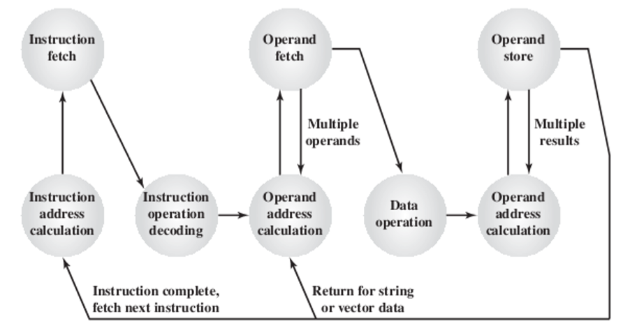

1. 首先从内存中取指令
2. 然后对于解析指令获得操作码(opcode)
3. 获取到操作数(oprand)
4. 回来的箭头表示的是类似数组这些东西进行循环操作

## 2.2. Instruction Cycle with Interrupts(含有中断的指令周期)

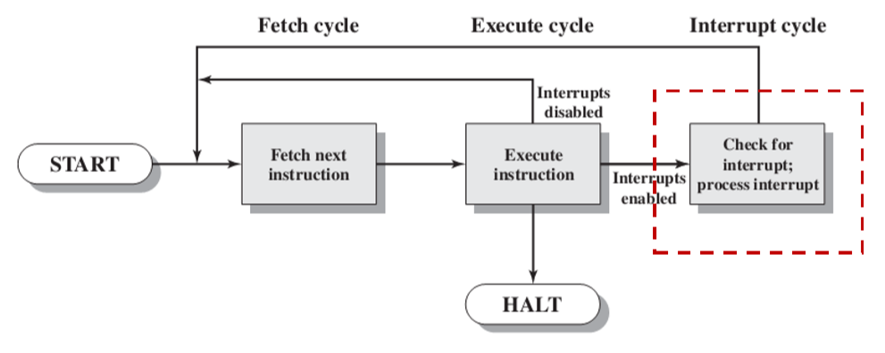

1. 开中断的时候响应中断，Interupt enabled
    + 每执行完成一次指令后要check有无中断并且进行处理。
2. 关中断的时候不响应中断

3. Instruction cycle state diagram with interrupts(带中断的指令周期状态图)

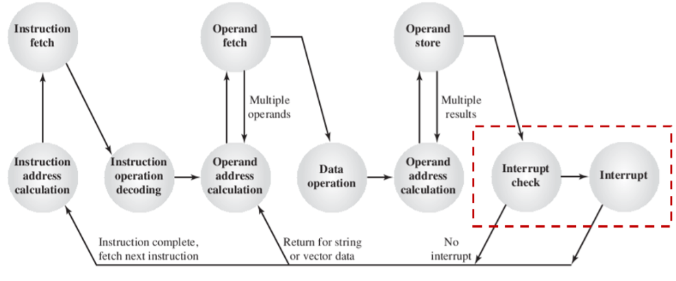

# 3. Instruction(指令)

## 3.1. Elements of instruction(指令包含元素) 
1. Operation code: specify the operation to be performed(操作码:确定需要去执行什么操作的指令)
2. Source operand reference: the operation may involve one or more source operands, that is, operands that are inputs for the operation(操作数的引用:操作可能包含一个或者更多的操作数，操作数是操作的输入)
3. Result operand reference: the operation may produce a result(结果操作数的引用:操作可能会产生结果)
4. Next instruction reference: tell the processor where to fetch the next instruction after the execution of this instruction is complete.(下一条指令的引用:告诉处理器在当前指令执行完成之后去哪里获得下一条指令)

## 3.2. Instruction representation 指令表示
1. Each instruction is represented by a sequence of bits(每一条指令都是被表示为字节的系列)
2. Instruction format: the instruction is divided into fields, corresponding to the constituent elements of the instruction(指令格式:指令被划分为各个部分，关联到指令的各个相应的部分)
3. With most instruction sets, more than one format is used(在大多数指令集中，都有超过一种指令格式被使用)
    + 要保证一条指令只能被一种格式解析出来，而别的解析出来都是错误的

4. Symbolic representation: help both the programmer and the reader of textbooks to deal with instructions(符号化表示:帮助程序员和文档的读者更加容易去处理操作)
5. Opcodes are represented by abbreviations, called mnemonics(操作码可以进一步由缩写表示，我们称为助记符)
    + ADD: add, SUB: subtract, MUL: multiply, DIV: divide, LOAD: load data from memory, STOR: store data to memory…
6. Operands are also represented symbolically(操作码可以被符号化的表示)
    + Replace operands with the register name or memory address(用寄存器的名字或者内存的地址代替操作数)

# 4. Operations
1. The number of different opcodes varies widely from machine to machine(不同的操作码的个数在不同机器中是不同的)
2. The same general types of operations are found on all machines(在所有的机器中都可以找到相同的操作类型)
    + Data transfer 数据转移
    + Arithmetic 数值运算
    + Logical 逻辑运算
    + Conversion 数值转换
    + I/O 输入输出
    + System control 系统控制
    + Transfer of control 传递控制

## 4.1. Data transfer(数据传输)
1. Specify the location of source and destination operands(指定源操作数和目标操作数的位置)
2. Indicate the length of data to be transferred(表明将要被传输的数据的长度)
3. Specify the mode of addressing for each operand(确定每一个操作数的地址的**模式**)

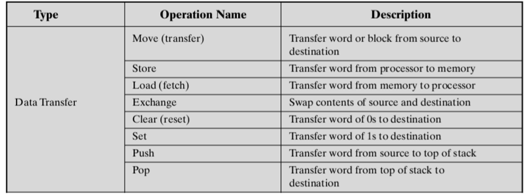

## 4.2. Arithmetic(运算)
1. The execution of an arithmetic instruction may involve data transfer operations to position operands for input to the ALU, and to deliver the output of the ALU(运算指令的执行可能包含数据传输到ALU中input位置的操作，以及运输ALU的计算结果)

## 4.3. Logical(逻辑)
1. Bit twiddling: manipulating individual bits of a word or other addressable units(位旋转:操作一个字或者其他可寻址单元大小的比特数)
2. Shifting and rotating function(偏移或者旋转操作)

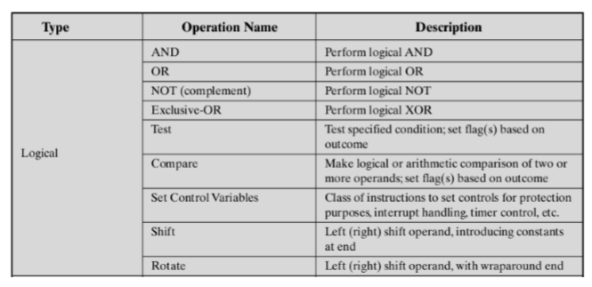

## 4.4. Conversion(转换)
1. Change the format or operate on the format of data(改变合适或者在数据的格式上进行操纵)

## 4.5. I/O 输入输出
1. A variety of I/O approaches are implemented by only a few I/O instructions, with the specific actions specified by parameters, codes, or command words(各种I/O方法仅由少量的I/O指令实现，具体操作由参数、代码或命令字指定)

## 4.6. Transfer of control 控制转换
1. Branch(分支)
2. Skip(跳过)
3. Procedure call(过程调用)

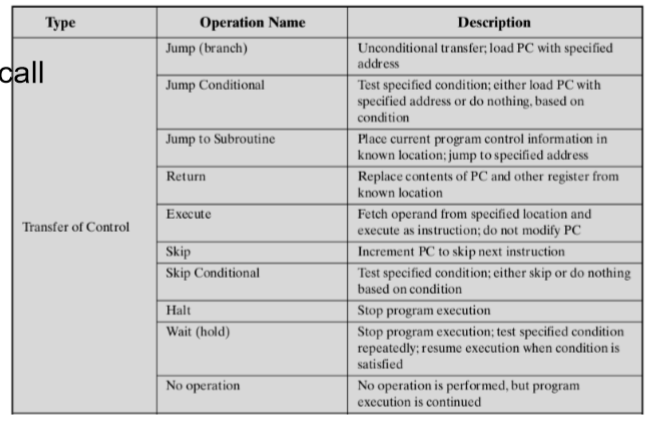

### 4.6.1. Branch / Jump:分支/跳转
1. has as one of its operand(有其操作数之一)

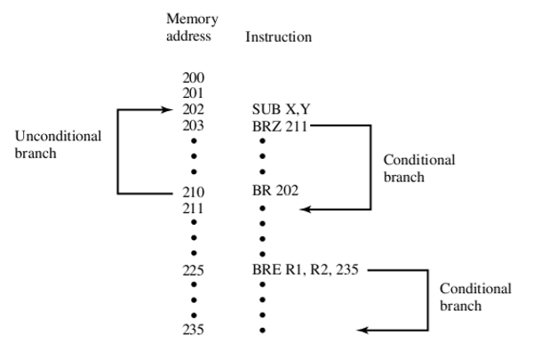

### 4.6.2. Skip:跳过
1. include an implied address, which equals the address of the next instruction plus one instruction length

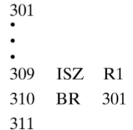

### 4.6.3. Procedure call:调用过程
1. a call instruction that branches from the present location to the procedure, and a return instruction that returns from the procedure to the place from which it was called(从当前位置分支到过程的调用指令，以及从过程返回到调用它的位置的返回指令)

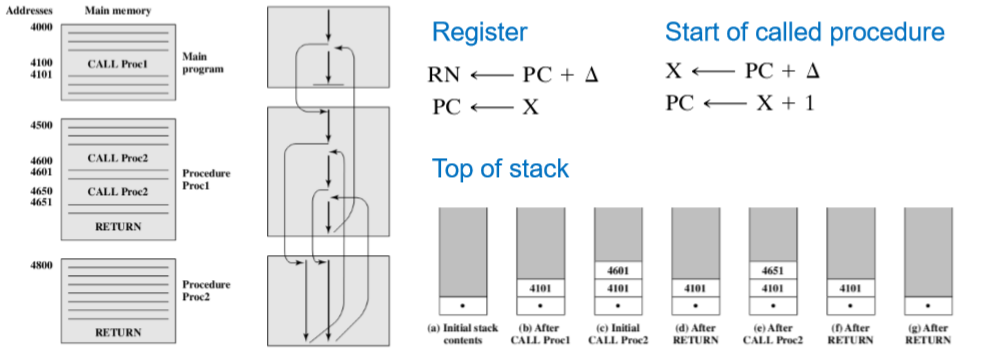

2. 如何保存当前指令地址
    + 我们先把PC放寄存器中，然后把当前地址压入PC
3. 问题:如果出现多层调用，那么就会出现无法回到主程序的问题
4. 问题解决:把地址写入到调用部分的头部
    + 还有小问题:支持嵌套，但是不支持递归

# 5. Operands(操作数)
1. The most important general categories of operands are(最重要的分类)
    1. Addresses 地址
    2. Numbers 数值
    3. Characters 字符
    4. Logical data 逻辑数据

## 5.1. Address(地址)
1. An instruction is required to contain four address references: two source operands, one destination operand, and the address of the next instruction(一个指令需要有四个地址引用:两个操作数，目标操作数，下一条指令的地址)
2. The address of the next instruction is implicit(下一条指令的地址是不清晰的)

### 5.1.1. 减少地址个数

1. 使用二进制合并操作数和结果的地址。
2. 如何减少内存地址个数
    + 首先加入到A进行计算。(最右侧)
3. 问题:地址越少，指令越多，时间比较长。
4. Fewer addresses per instruction result in instructions that are more primitive, requiring a less complex processor and shorter instruction length(每条指令的地址越少，指令就越原始，需要的处理器越简单，指令长度越短)
5. Programs contain more total instructions, which in general results in longer execution times and longer, more complex programs(程序包含更多的总指令，这通常会导致更长的执行时间和更长、更复杂的程序)
6. With multiple-address instructions, it is common to have multiple general purpose registers, which allows some operations to be performed solely on registers and makes program execution faster(对于多地址指令，通常有多个通用寄存器，这使得某些操作可以单独在寄存器上执行，并使程序执行更快)

## 5.2. Numbers(数字)
1. Numbers stored in a computer are limited(存储到计算机中的数字是被限制的)
    1. Limitation on the magnitude of numbers(数量限制)
    2. Limitation on the precision of floating-point numbers(浮点数精度的限制)
2. Types of numerical data(数值型数据的类型)
    1. Binary integer or binary fixed point(二进制整数或者二进制定点小数)
    2. Binary floating point(二进制浮点小数)
    3. Decimal(十进制数字)

## 5.3. Characters(字符)
1. International reference alphabet (IRA) / American standard code for information interchange (ASCII): 7 bits(国际参考字母表(IRA)/美国信息交换标准代码(ASCII)：7位)
2. Extended Binary Coded Decimal Interchange Code (EBCDIC): 8 bits(扩展二进制编码十进制交换码(EBCDIC):8位)
3. Unicode: 16 bits / 32 bits

## 5.4. Logical data(逻辑数据)
1.  Consider an n-bit unit as consisting of n 1-bit items of data, each item having the value 0 or 1(考虑一个由n个1位数据组成的n位的单元，单元每个部分都是值0或者1)
    1. Store an array of Boolean or binary data items, in which each item can take on only the values 1 (true) and 0 (false)(存储布尔类型或者二进制数据组的数组，这些数组中的元素1表示true，0表示false)
    2. There are occasions when we wish to manipulate the bits of a data item(有时候我们希望操作数据项的位)

## 5.5. Big endian ordering and little endian ordering(大端模式和小端模式)
1. Suppose we have the 32-bit hexadecimal value 12345678 and that it is stored in a 32-bit word in byte-addressable memory at byte location 184(假设我们有一个32位的16进制字符串12345678，并且它被存储到地址为184的部分上)

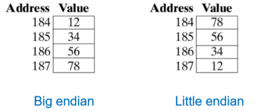

2. Each data item has the same address in both schemes(两个方案中的每个数据项都有相同的地址)
3. Within any given multibyte scalar value, the ordering of bytes in the littleendian structure is the reverse of that for the big-endian structure(在任何给定的多字节标量值中，小端结构中的字节顺序和大端结构相反)
4. Endianness does not affect the ordering of data items within a structure(大端结构并不影响数据本身在数据结构中的顺序)
    + 也就是说只可能块间顺序改变而不可能是块内顺序的改变

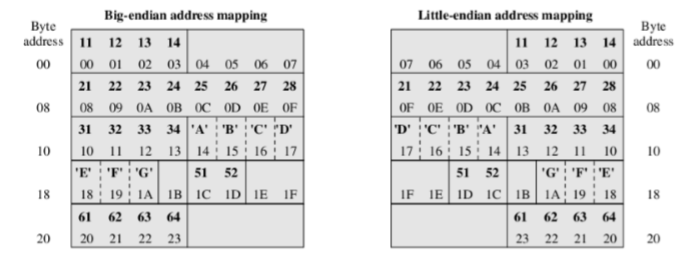

### 5.5.1. Big endian(大端)
1. Character-string sorting(字符串排序)
2. Decimal / IRA dumps(十进制/IRA存储)
3. Consistent order(固定的顺序)

### 5.5.2. Little endian(小端)
1. Easier to converts a 32-bit integer address to a 16-bit integer address(比较易于把32位整数地址转换成为16位整数地址)
2. **Easier to perform higher-precision arithmetic(容易进行高精度的计算)**

# 6. Operand Reference Format(操作码引用的格式)
1.  An operand reference in an instruction(在指令中的操作数的引用)
    1. Actual value of the operand(操作数的真实值)
    2. Address of the operand(操作数的地址)
        1. Register(寄存器)
        2. Main memory / virtual memory(主存/虚拟内存)
        3. …

## 6.1. Addressing Modes(寻址模式)
1. Immediate(立即寻址)
2. Direct(直接寻址)
3. Indirect(间址寻址)
4. Register(寄存器寻址)
5. Register indirect(寄存器间接寻址)
6. Displacement(偏移寻址)
7. Stack(栈寻址)
8. Eg.**直接给你操作数不是直接寻址，而是立即寻址**

## 6.2. Notation(符号约定)
1. A: contents of an address field in the instruction(A:指令中地址字段的内容)
2. R: contents of an address field in the instruction that refers to a register(R:指令中引用到寄存器中的地址字段的内容)
3. EA: actual (effective) address of the location containing the referenced operand(EA:包含引用操作数的位置的实际(有效)地址)
4. (X): contents of memory location X or register X(在寄存器X或者地址X中的内容)

## 6.3. Immediate Addressing(立即寻址)

### 6.3.1. Mode
1. operand value is present in the instruction
2. 操作数的值被直接给在指令中

### 6.3.2. Usage
define and use constants or set initial values of variables(定义并且使用常量或者设置变量的初始值)

### 6.3.3. Algorithm
Operand = A

### 6.3.4. Advantage
no memory reference other than the instruction fetch is required to obtain the operand(不需要从内存中拿出数据)

### 6.3.5. Disadvantage
the size of the number is restricted to the size of the address field(获取操作数不需要指令获取以外的内存引用)

## 6.4. Direct Addressing(直接寻址)

### 6.4.1. Mode
Address field contains the effective address of operand(地址空间包含有操作数的有效的地址)

### 6.4.2. Usage
common in earlier generations of computers but is not common on contemporary architectures(从用于计算机早期，但是在当前的计算机结构中不常见)

### 6.4.3. Algorithm
EA = A

### 6.4.4. Advantage
1. only one memory reference and no special calculation(只有一个内存的引用，不需要进行特殊的计算)
2. 无内存地址的计算

### 6.4.5. Disadvantage
1. limited address space 受限的内存空间

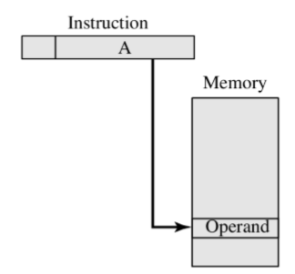

## 6.5. Indirect Addressing(间接寻址)

### 6.5.1. Mode
Address field refer to the address of a word in memory, which in turn contains a full-length address of operand(地址字段是指内存中一个字的地址，它又包含一个操作数的全长地址)

### 6.5.2. Algorithm
EA = (A)

### 6.5.3. Advantage
enlarge address space(增大地址空间)

### 6.5.4. Disadvantage
require two memory references to fetch the operand(需要使用两次内存引用来拉取操作数)

### 6.5.5. Comment
limitation of the number of address reference can be an asset(地址引用的数量限制可以是一个问题)

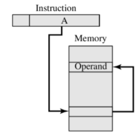

## 6.6. Register Addressing(寄存器寻址)

### 6.6.1. Mode
address field refers to a register(地址空间被指向一个寄存器)

### 6.6.2. Algorithm
EA = R

### 6.6.3. Advantage
only a small address field is needed in the instruction, and no time-consuming memory references are required(指令只需要一个小地址字段，不需要耗时的内存引用)

### 6.6.4. Disadvantage
address space is very limited(地址空间会受限)

### 6.6.5. Comment
the usage of registers makes sense only if they are employed efficiently(寄存器的使用有意义当切仅当他们被有效地组织起来)

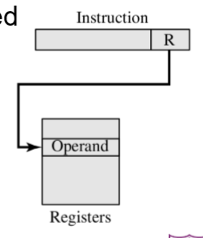

## 6.7. Register Indirect Addressing(寄存器间接寻址)

### 6.7.1. Mode
address field refers to a register(地址空间被指向一个寄存器)

### 6.7.2. Algorithm
EA = (R)

### 6.7.3. Advantage
enlarge address space, and use one less memory reference than indirect addressing(扩大地址空间，并且使用比间接寻址使用少一个地址引用)

### 6.7.4. Disadvantage
require one more memory reference(需要多一个内存引用)

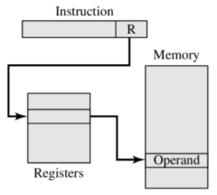

## 6.8. Displacement Addressing(偏移寻址)
1. Mode: combine the capabilities of direct addressing and register indirect addressing(结合了直接寻址和寄存器间接寻址的优点)
2. Algorithm: EA = (R) + A
    + 寄存器中的值加上偏移值。
3. Type:
    1. Relative addressing(相对寻址)
    2. Base-register addressing(基址寻址)
    3. Indexing(间址寻址)
4. Comment: requires that the instruction have two address fields, at least one of which is explicit(要求指令有两个地址字段，其中至少有一个是显式的)

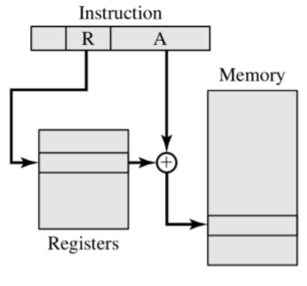

### 6.8.1. Relative addressing(相对寻址)
1. Mode: the implicitly referenced register is the program counter (PC), i.e., the next instruction address is added to the address field to produce the EA(隐式引用的寄存器是程序计数器(PC)，即下一个指令地址被添加到地址字段中以生成EA)
    + 使用的是PC，根据局部性原理，A不会太大
2. Usage: floating of public subroutine or relative transfer(公共子程序的浮动或者相对偏移)
3. Algorithm: EA = (PC) + A
    + A的长度会比较短
4. Advantage: exploits the concept of program locality, and save address bits in the instruction(利用程序局部性的概念，在指令中保存地址位)

### 6.8.2. Base-register addressing(基址寻址)
1. Mode: The referenced register contains a main memory address, and the address field contains a displacement from that address. The register reference may be explicit or implicit(引用的寄存器包含一个主存地址，地址字段包含该地址的位移。寄存器引用可以是显式的或隐式的)
2. Algorithm: EA = (B) + A
3. Usage: program relocation in virtual memory space(程序在虚拟地址中再分配地址)
4. 我写相对开头的位置的偏移量是多少。

### 6.8.3. Indexing(间址寻址)
1. Mode: The address field references a main memory address, and the referenced register contains a positive displacement from that address(地址字段引用主存储器地址，引用的寄存器包含该地址的正位移)
2. Algorithm: EA = A + (B)
3. Usage: provide an efficient mechanism for performing iterative operations(提供执行迭代操作的有效机制)
4. Extension: combine indirect addressing and indexing(间接寻址与索引结合)
5. Pre-indexing: EA = (A + (R))(前间址)
6. Post-indexing: EA = (A) + (R)(后间址)
7. 参考数组:A是指开头的地址，B是下标，使用了自增寄存器

## 6.9. Stack Addressing(栈寻址)
1. Mode: The stack pointer is maintained in a register. So references to stack locations in memory are in fact register indirect addresses.(堆栈指针保存在寄存器中。所以对内存中堆栈位置的引用实际上是寄存器间接地址。)
2. Comment: Associated with the stack is a pointer references the top of the stack or the third element of the stack (the top two elements of the stack may be in processor registers)(注释：与堆栈相关的是一个指针，它引用堆栈的顶部或堆栈的第三个元素(堆栈的顶部两个元素可能在处理器寄存器中))

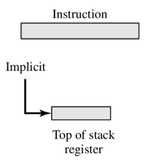

# 7. Instruction Set Design 指令集设计
1. The instruction set defines many of the functions performed by the processor and thus has a significant effect on the implementation of the processor(指令集定义了处理器执行的许多功能，因此对处理器的实现有重要影响)
2. Programmer requirements must be considered in designing the instruction set(在设计指令集时必须考虑程序员的要求)
3. Fundamental design issues(基本设计问题)
    1. Operation repertoire: How many and which operations to provide, and how complex operations should be(操作个数：提供多少操作、哪些操作以及操作的复杂程度)
    2. Data types: The various types of data upon which operations are performed(数据类型：执行操作所依据的各种数据类型)
    3. Instruction format: Instruction length (in bits), number of addresses, size of various fields, and so on(指令格式:指令长度，地址数，其他域的大小以及很多)
    4. Registers: Number of processor registers that can be referenced by instructions, and their use(寄存器:处理器寄存器的个数可以被指令以及其他需求使用)
    5. Addressing: The mode or modes by which the address of an operand is specified(寻址方式:指定操作数地址的一种或多种模式)

# 8. Instruction Format(指令格式)
1. An instruction format defines the layout of the bits of an instruction, in terms of its constituent fields(指令格式根据其组成字段定义指令位的布局)
2. An instruction format must include an opcode and, implicitly or explicitly, zero or more operands(指令格式**必须包含操作码**，并且**隐式或显式地**包含零个或多个操作数)
3. The format must, implicitly or explicitly, indicate the addressing mode for each operand(格式必须**隐式或显式**地指示每个操作数的寻址模式)
4. For most instruction sets, more than one instruction format is used(对于大多数指令集，都有超过一种指令格式被使用)

## 8.1. Instruction Length(指令长度)
1. The most obvious trade-off here is between the desire for a powerful instruction repertoire and a need to save space(这里最明显的权衡是想要一个强大的指令集合和需要节省空间)
    1. Programmers want more opcodes, more operands, more addressing modes, and greater address range(程序员需要更多的操作码、更多的操作数、更多的寻址模式和更大的地址范围)
    2. Longer instruction length may be wasteful(较长的指令长度可能会浪费)
2. Either the instruction length should be equal to the memorytransfer length or one should be a multiple of the other(指令长度应该等于内存传输长度，或者一个应该是另一个的倍数)
3. Shorter instruction can reduce transfer time(缩短指令可以减少传输时间)
4. Instruction length should be a multiple of the character length and of the length of fixed-point numbers(指令长度应该是字符长度和定点数长度的倍数)

## 8.2. Allocation of Bits(分配指令长度)
1. For a given instruction length, there is clearly a tradeoff between the number of opcodes and the power of the addressing capability(对于给定的指令长度，在操作码的数量和寻址能力之间显然存在一种折衷)
2. Use of variable-length opcodes 变长操作数的使用
    + Use a minimum opcode length but, for some opcodes, additional operations may be specified by using additional bits in the instruction(使用最小操作码长度，但对于某些操作码，可以通过在指令中使用附加位来指定附加操作)

3. Factors of addressing bits 地址位数的影响因素
    1. Number of addressing modes(寻址模式个数)
    2. Number of operands(操作数)
    3. Register versus memory: The more that registers can be used for operand references, the fewer bits are needed(寄存器与内存：寄存器用于操作数引用的次数越多，所需的位就越少)
    4. Number of register sets: for a fixed number of registers, a functional split requires fewer bits to be used in the instruction(寄存器组数：对于固定数量的寄存器，函数拆分要求在指令中使用更少的位)
    5. Address range(地址范围)
    6. Address granularity)(地址粒度)

## 8.3. Variable-Length Instructions(可变长操作数)
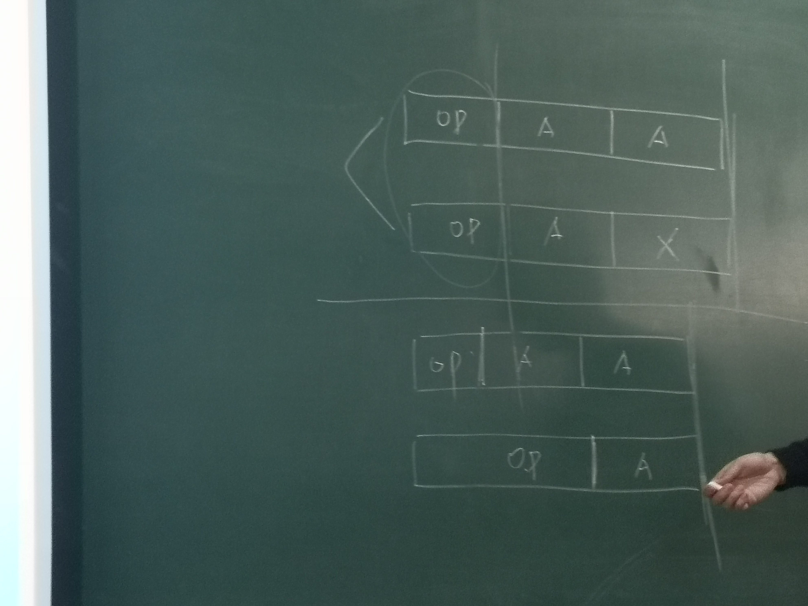

1. 可边长操作码:使得指令一般会相对更加短(如上图)
    + 问题:存在二义性，如果确定到底是op+A还是op
    + 解决问题:对于底下两个可边长的操作码，显然最低下的op的前几位不能和倒数第二个操作码的op没有交集，才能保证无**二义性**。
2. 可边长指令:指令的长度的不确定

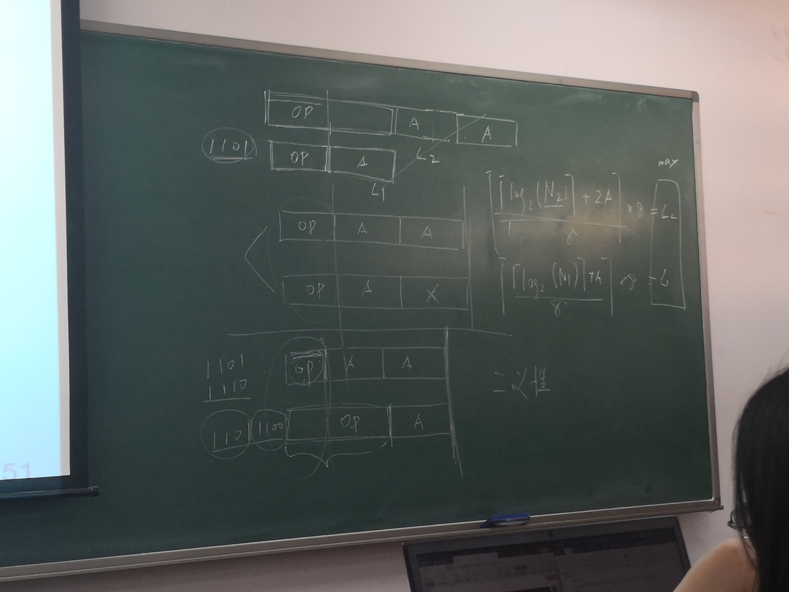

3. Provide a variety of instruction formats of different lengths(提供了不同长度的多种指令的格式)
4. 必须要避免二义性。

### 8.3.1. Advantage
1. Easy to provide a large repertoire of opcodes, with different opcode lengths(易于提供大量操作码，具有不同的操作码长度)
2. Addressing can be more flexible, with various combinations of register and memory references plus addressing modes(寻址可以更灵活，具有寄存器和存储器引用加寻址模式的各种组合。)

### 8.3.2. Disadvantage
1. increase the complexity of processor(提高了CPU的复杂度，为了避免二义性和对于指令的判断增加了其复杂度)
2. Fetch a number of bytes or words equal to at least the longest possible instruction(获取至少等于最长指令的字节数或字数)

# 9. 问题
1. 16G的物理内存，如果想要加载进5个4G的程序，我们使用4G的物理内存可以吗？
    + 不可以，因为虚拟地址和物理地址之间的转换是铺不开的。
    + 硬性要求不足