Control Unit Operation
---
<!-- TOC -->

- [1. Function of A Processor(处理器的功能)](#1-function-of-a-processor处理器的功能)
- [2. Micro-Operations 微操作](#2-micro-operations-微操作)
    - [2.1. Fetch Cycle(取指周期)](#21-fetch-cycle取指周期)
    - [2.2. Two Simple Rules of Grouping Microoperations(两种对于微操作进行分组的简单原则)](#22-two-simple-rules-of-grouping-microoperations两种对于微操作进行分组的简单原则)
    - [2.3. Indirect Cycle(间址周期)](#23-indirect-cycle间址周期)
    - [2.4. Interrupt Cycle(中断周期)](#24-interrupt-cycle中断周期)
    - [2.5. Execute Cycle(执行周期)](#25-execute-cycle执行周期)
    - [2.6. Instruction Cycle(指令周期)](#26-instruction-cycle指令周期)
- [3. Functional Requirements of Processor Control 处理器控制需要的功能](#3-functional-requirements-of-processor-control-处理器控制需要的功能)
    - [3.1. Input / Output of Control Unit 控制单元的输入和输出](#31-input--output-of-control-unit-控制单元的输入和输出)
        - [3.1.1. Input(输入) 控制单元的输入类型](#311-input输入-控制单元的输入类型)
        - [3.1.2. Output(输出)](#312-output输出)
    - [3.2. Control Signal(控制信号)](#32-control-signal控制信号)
    - [3.3. Minimal Nature of Control Unit(控制单元的最小性质)](#33-minimal-nature-of-control-unit控制单元的最小性质)
    - [3.4. Internal Processor Bus(内部处理器总线)](#34-internal-processor-bus内部处理器总线)
    - [3.5. Control Unit Implementation 控制单元的实现](#35-control-unit-implementation-控制单元的实现)
        - [3.5.1. Control unit inputs(控制单元输入)](#351-control-unit-inputs控制单元输入)
        - [3.5.2. Control unit inputs: IR 控制单元的输入:IR(instruction register)](#352-control-unit-inputs-ir-控制单元的输入irinstruction-register)
        - [3.5.3. Control unit inputs: clock 控制单元的输入:时钟](#353-control-unit-inputs-clock-控制单元的输入时钟)
        - [3.5.4. Control unit logic 控制单元逻辑](#354-control-unit-logic-控制单元逻辑)
    - [3.6. Microprogramming Language 微编程](#36-microprogramming-language-微编程)
        - [3.6.1. Basic Idea 基本思想](#361-basic-idea-基本思想)
        - [3.6.2. Microinstruction Interpretation 微操作 中断](#362-microinstruction-interpretation-微操作-中断)
        - [3.6.3. Microprogrammed Control Unit 微编程 控制单元](#363-microprogrammed-control-unit-微编程-控制单元)
        - [3.6.4. Adventages and Disadventages 和硬连线比较](#364-adventages-and-disadventages-和硬连线比较)
    - [3.7. Task of Microprogrammed Control Unit 微编程控制单元的任务](#37-task-of-microprogrammed-control-unit-微编程控制单元的任务)
    - [3.8. Microinstruction Sequencing 未讲](#38-microinstruction-sequencing-未讲)
    - [3.9. Category 类别](#39-category-类别)
    - [3.10. Address generation](#310-address-generation)
- [4. Microinstruction Execution](#4-microinstruction-execution)

<!-- /TOC -->

# 1. Function of A Processor(处理器的功能)
1. Operations (opcodes) 操作
2. Addressing modes 地址模式
3. Registers 寄存器
4. I/O module interface I/O模块接口
5. Memory module interface 内存模块接口
6. Interrupts 中断接口
7. 前三个是被**指令集**定义，中间两个是被**确定的系统总线**确定，最后一个是部分由**系统总线**，部分由支持的操作总线的类型决定。

# 2. Micro-Operations 微操作
1. The operation of a computer, in executing a program, consists of a sequence of instruction cycles, with one machine instruction per cycle(计算机在执行一个程序时的操作，由一系列指令周期组成，每周期一条机器指令)
2. Each instruction cycle is made up of a number of smaller units(每一个操作循环都是被一些小单元组成的)
    + E.g.:  fetch, indirect, execute, and interrupt(取指、间址、执行、中断)
3. Each of the smaller cycles involves a series of steps, each of which involves the processor registers(每一个小周期都由**一系列步骤**组成，每一个步骤都需要处理器的寄存器参与)
4. These steps are referred to as **micro-operations**(这些步骤被认为是微操作)
    + 相对于取指、间指等操作更小的操作
    + 什么时候做更细分的操作

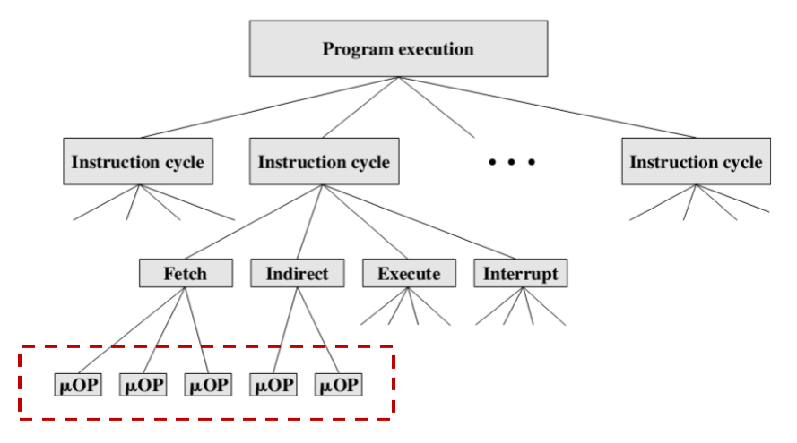

## 2.1. Fetch Cycle(取指周期)
1. It occurs at the beginning of each instruction cycle and causes an instruction to be fetched from memory 在每一个指令周期的开始，并且使得指令从内存中被读取出来

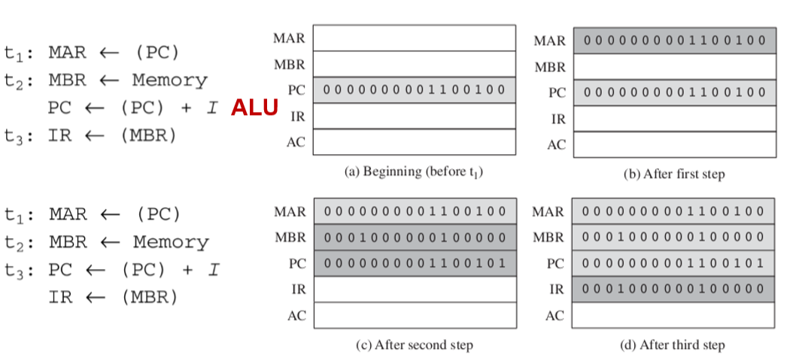

2. 操作中包含一个个微操作。上图包含4个微操作，其中中间两个微操作同时执行。
    + **时间要尽可能少，提高效率**，
    + 同时执行就是**谁先谁后**都不要紧，也就是在数据控制等部分上没有出现冲突的问题
3. 限制同时执行的两种方式:
    1. 涉及到同一个设备
    2. 具有逻辑先后关系

## 2.2. Two Simple Rules of Grouping Microoperations(两种对于微操作进行分组的简单原则)
1. The proper sequence of events must be followed(事务有先后关系)
    + E.g.: (MAR <- (PC)) must precede (MBR <- Memory) because the memory read operation makes use of the address in the MAR 内存读操作冲突 MAR <- (PC)必须优先于 MBR <- Memory执行因为内存读取操作需要使用到在MAR中存储的内存地址。
2. Conflicts must be avoided(冲突必须要被避免)
    + E.g.: (MBR <- Memory) and (IR <- MBR) should not occur during the same time unit MBR <- Memory 和 IR <- MBR不可以在同一个时间单元上发生

## 2.3. Indirect Cycle(间址周期)
1. If the instruction specifies an indirect address, then an indirect cycle must precede the execute cycle 如果指令指定了间接地址，则间接循环必须在执行循环之前完成

2. IR is now in the same state as if indirect addressing had not been used, and it is ready for the execute cycle(IR现在处于与未使用间接寻址相同的状态，并且已准备好执行周期)

## 2.4. Interrupt Cycle(中断周期)
1. After execute cycle, a test is made to determine whether any enabled interrupts have occurred 在执行周期之后，进行测试以确定是否发生了任何启用的中断
2. If so, the interrupt cycle occurs 如果是的，那么中断周期发生

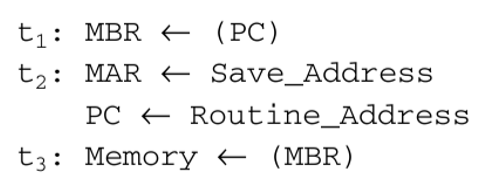

3. 前两个微操作做t1，后两个微操作做t2可以吗？
    + 可以两步做完

## 2.5. Execute Cycle(执行周期)
1. With the variety opcodes, there are a number of different sequences of micro-operations that can occur(使用很多的操作码，这里有很大数量的微指令序列可以发生)
2. Add instruction(加操作)
    + 若删去R1，那么我们需要使用AC寄存器来放置。

3. Increment and skip if zero(增加并且跳转，就是为什么Jz指令为0)

4. Branch-and-save-address instruction(分支保存地址的指令)

## 2.6. Instruction Cycle(指令周期)
1. There is one sequence each for the fetch, indirect, and interrupt cycles, and, for the execute cycle, there is one sequence of micro-operations for each opcode(对于获取、间接和中断周期，每个序列都有一个；对于执行周期，每个操作码都有一个微操作序列)
2. Assume a new 2-bit register called the instruction cycle code (ICC), which designates the state of the processor in terms of which portion of the cycle it is in(假设一个新的2位**寄存器**称为指令周期码（ICC)，它根据处理器所处周期的哪一部分来指定处理器的状态)
    1. 00: Fetch(取指)
    2. 01: Indirect(间址)
    3. 10: Execute(执行)
    4. 11: Interrupt(中断)

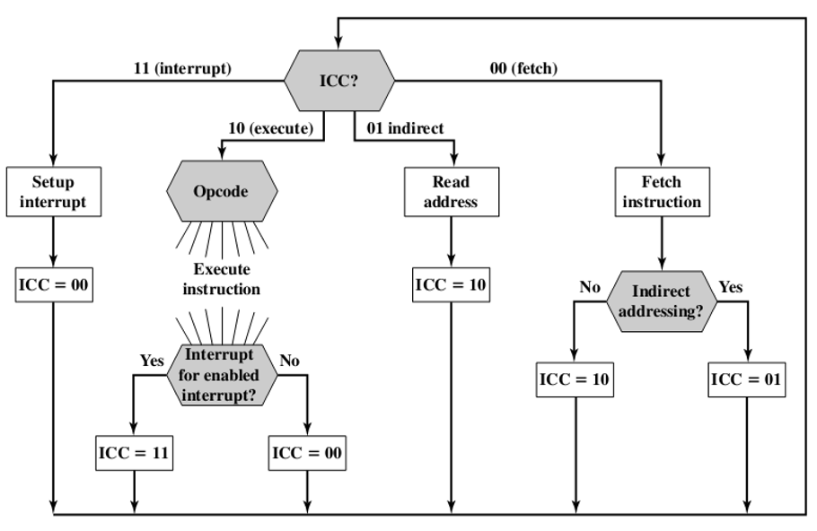

# 3. Functional Requirements of Processor Control 处理器控制需要的功能
1. By reducing the operation of the processor to its most fundamental level, we are able to define exactly what it is that the control unit must cause to happen, i.e., define the  functional requirements for the control unit 通过将处理器的操作减少到最基本的级别，我们能够准确地定义控制单元必须导致的情况，即定义控制单元的功能需求
2. Three steps:(三个步骤)
    1. Define the basic elements of the processor(定义处理器的基本元素)
    2. Describe the micro-operations that the processor performs(描述处理器执行的微操作)
    3. Determine the functions that the control unit must perform to cause the micro-operations to be performed(确定控制单元必须执行的功能，以便执行微操作)
3. Basic functional elements of the processor(处理器的基本功能元件)
    1. ALU
    2. Registers
    3. Internal data paths 内部数据通路
    4. External data paths 外部数据通路
    5. Control unit
4. All micro-operations fall into one of the following categories(所有微指令都属于以下类别之一)
    1. Transfer data from one register to another(从寄存器中转移数据到另一个寄存器中去)
    2. Transfer data from a register to an external interface (e.g., system bus)(从寄存器中读出数据传送给一个外部接口)
    3. Transfer data from an external interface to a register(从外部接口传输数据到寄存器中)
    4. Perform an arithmetic or logic operation, using registers for input and output(进行数值或者逻辑计算，使用寄存器来存储输入和输出)
    5. 也就会内部转移、寄存器和外部接口交换、寄存器存储数值计算结果
5. Two basic tasks of control unit(**控制单元的两项基本任务**)(*function?*)
    1. Sequencing: The control unit causes the processor to step through a series of micro-operations in the proper sequence, based on the program being executed(排序：控制单元根据执行的程序，使处理器按正确的顺序逐步完成一系列微操作)
    2. Execution: The control unit causes each micro-operation to be performed(执行：控制单元使每个微操作执行)

## 3.1. Input / Output of Control Unit 控制单元的输入和输出
1. General model of control unit with all inputs and outputs(具有所有输入和输出的控制单元的通用模型)
    + 控制单元的输出只有控制信号。
2. **控制信号不全由控制单元发出。**
    + 比如中断信号

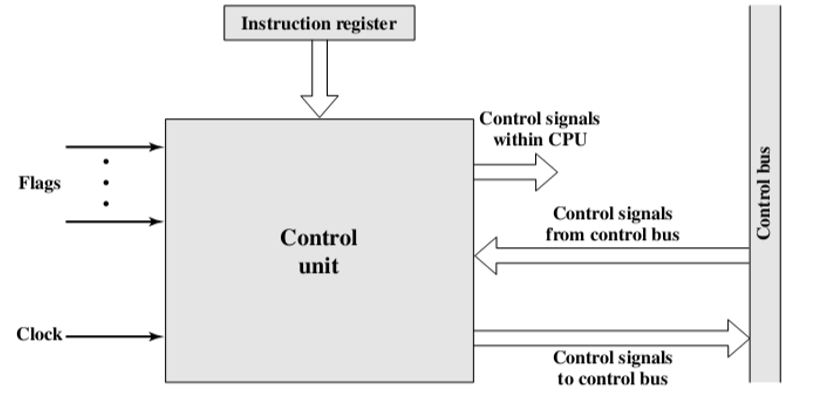

### 3.1.1. Input(输入) 控制单元的输入类型
1. Clock: control unit causes one micro-operation or a set of simultaneous micro-operations to be performed for each clock pulse(时钟：控制单元使每个时钟脉冲执行一个微操作或同时执行一组微操作)
2. Instruction register: opcode and addressing mode of current instruction(指令寄存器：当前指令的操作码和寻址方式)
3. Flags: determine the status of the processor and the outcome of previous ALU operations(标志：确定处理器的状态和以前ALU操作的结果)
4. Control signals from control bus: provide signals to the control unit, such as interrupt request and response(来自控制总线的控制信号：向控制单元提供信号，如中断请求和响应)

### 3.1.2. Output(输出)
1. Control signals within the processor: These are two types: those that cause data to be moved from one register to another, and those that activate specific ALU functions(**处理器内的控制信号**：这有两种类型：一种是导致数据从一个寄存器移动到另一个寄存器的信号，另一种是激活特定ALU功能的信号)
2. Control signals to control bus: These are also of two types: control signals to memory, and control signals to the I/O modules(**控制总线的控制信号**：这些信号也有两种类型：存储器的控制信号和I/O模块的控制信号)

## 3.2. Control Signal(控制信号)
1. **Three types of control signals(三种控制信号)**
    1. Activate an ALU function(激活ALU的功能)
    2. Activate a data path(激活数据通路)
    3. Signals on the external system bus or other external interface(通过系统总线或者其他外部接口传递来的信号)
2. All of these signals are ultimately applied directly as binary inputs to individual logic gates(**所有这些信号最终都作为二进制输入直接应用于各个逻辑门**)
3. Example: Fetch cycle(取指周期)
    1. Transfer the contents of PC to MAR(传递PC中的内容给MAR)
        + A control signal that opens the gates between the bits of PC and MAR 一个打开PC和MAR之间的数据传输的控制信号
    2. Read a word from memory into the MBR and increment PC(从内存中读出一个字进入MBR并且PC自增)
        1. A control signal that opens gates, allowing the contents of MAR onto the address bus(一种打开门的控制信号，允许MAR的内容进入地址总线)
        2. A memory read control signal on the control bus(控制总线上的存储器读取控制信号)
        3. A control signal that opens the gates, allowing the contents of the data bus to be stored in MBR(一种打开门的控制信号，允许数据总线的内容存储在MBR中)
        4. Control signals to logic that add 1 to PC content and store the result back to PC(控制信号到逻辑，将1添加到PC内容并将结果存储回PC)
4. Example(例子)
    1. Data paths(数据通路)
    2. ALU
    3. System bus

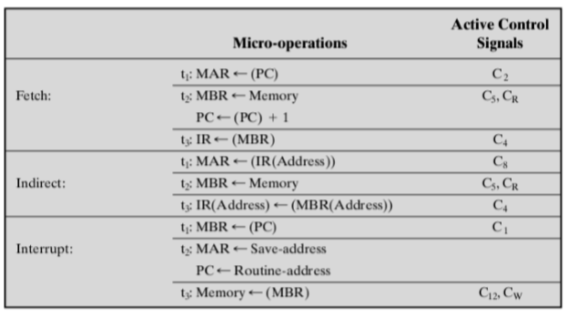
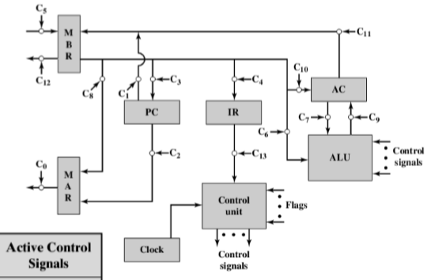

5. 小圆点都是门，CR是表示读信号
    + 电路保证门通则数据流过，否则数据无法流过。
    + 必须要为所有的门进行设置，不然会出现问题。
    + 只需要确定好状态的01字符串就好
6. **是一个固定长度二进制串用来控制相应的门的开关**。
    + 特定位置上的门的开关根据0和1来决定

## 3.3. Minimal Nature of Control Unit(控制单元的最小性质)
1. It does this based only on knowing the instructions to be executed and the nature of the results of arithmetic and logical operations(它只基于知道要执行的指令以及算术和逻辑运算结果的性质)
    + E.g., positive, overflow, …
2. It never gets to see the data being processed or the actual results produced(它永远看不到正在处理的数据或产生的实际结果)
3. It controls everything with a few control signals to points within the processor and a few control signals to the system bus(它用一些控制信号来控制处理器内的点，用一些控制信号来控制系统总线)

## 3.4. Internal Processor Bus(内部处理器总线)
1. A single internal bus connects the ALU and all processor registers(一条内部总线连接ALU和所有处理器寄存器)
2. Gates and control signals are provided for movement of data onto and off the bus from each register(提供门和控制信号，用于将数据从每个寄存器移动到总线上或从总线上移动到总线上)
3. Additional control signals control data transfer to and from the system (external) bus and the operation of the ALU(附加控制信号控制系统（外部)总线和ALU操作之间的数据传输)
    + 为什么要把数据加载到Y中?先把数据加载到Y，然后从AC中读出数据到ALU
    + 为什么要把数据加载到Z呢？用寄存器暂存结果，必须关闭ALU和系统总线之间的门，防止ALU不断变大。

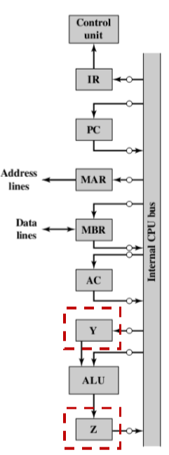
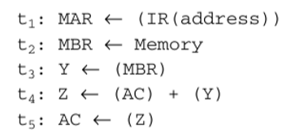

4. 如果AC和MBR对调可以嘛？可以(存疑)

## 3.5. Control Unit Implementation 控制单元的实现
1. Two categories:(两种类型)
    1. Hardwired implementation(硬连线实现)
    2. Microprogrammed implementation(微编程实现)
2. In a **hardwired implementation**, the control unit is essentially a state machine circuit(在硬接线实现中，控制单元本质上是一个状态机电路)(考)
    1. Its input logic signals are transformed into a set of output logic signals, which are the control signals(它的输入逻辑信号被转换成一组输出逻辑信号，即控制信号)
    2. 控制信号为1或者0，进行处理，不能够直接拿过来使用

### 3.5.1. Control unit inputs(控制单元输入)
1. **Key inputs**: instruction register (IR), clock, flags, and control bus signals(关键输入：指令寄存器（IR)、时钟、标志和控制总线信号)
2. In the case of the flags and control bus signals, each individual bit typically has some meaning(在标记和控制总线信号的情况下，每个单独的位通常具有一些含义)
3. The other two inputs, IR and clock, are not directly useful to the control unit 另外两个输入（红外和时钟)对控制单元没有直接作用

### 3.5.2. Control unit inputs: IR 控制单元的输入:IR(instruction register)
1. To simplify the control unit logic, there should be a unique logic input for each opcode 为了简化控制单元逻辑，每个操作码应有一个唯一的逻辑输入
2. A decoder with n binary inputs has 2𝑛 binary outputs 一个n个二进制输入的解码器有2个二进制输出
3. The decoder for a control unit is more complex to account for variable-length opcodes 对于可变长度的操作码，控制单元的解码器更为复杂
4. 输入为I1 - I4,输出为O1 - O16，观察其形式

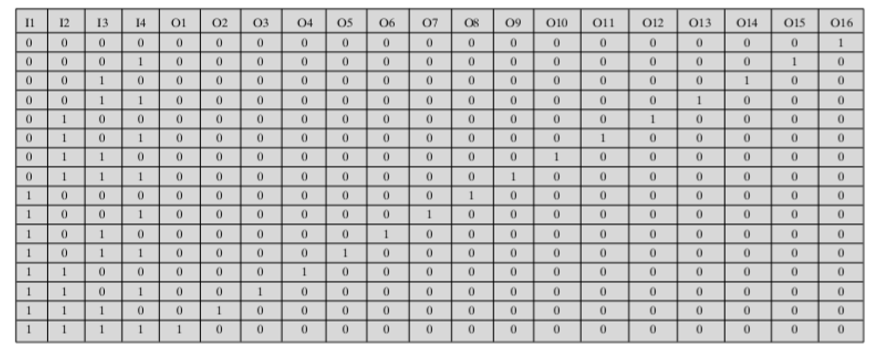

### 3.5.3. Control unit inputs: clock 控制单元的输入:时钟
1. The period of the clock pulses must be long enough to allow the propagation of signals along data paths and through processor circuitry 时钟脉冲的周期必须足够长，以允许信号沿数据路径和通过处理器电路传播
2. Control unit emits different control signals at different time units within a single instruction cycle 控制单元在一个指令周期内以不同的时间单位发出不同的控制信号
3. Use a counter as input to control unit, and control unit must feed back to the counter to reinitialize it 使用计数器作为控制单元的输入，控制单元必须反馈给计数器以重新初始化它

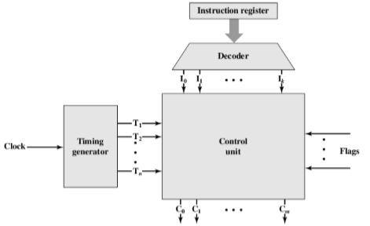

4. 例子在时钟周期中，在Fetch、Indirect、Execute周期中的T2时刻需要打开C5门，所以我们使用PQ来标识具体是什么周期
    + 可以按照真值表进行判断和解码。

### 3.5.4. Control unit logic 控制单元逻辑
1. What must be done is, for each control signal, to derive a Boolean expression of that signal as a function of the inputs 必须做的是，对于每个控制信号，导出该信号的布尔表达式作为输入函数
2. Define two new control signals P and Q 定义两个新的控制信号P和Q
    1. PQ = 11  Interrupt Cycle 中断周期
    2. PQ = 10  Execute Cycle 执行周期
    3. PQ = 01  Indirect Cycle 间址周期
    4. PQ = 00  Fetch Cycle 取指周期
3.  Example
    1. C5: cause data to be read from the external data bus into MBR 使数据从外部数据总线读入MBR
    2. C5 is asserted during the second time unit of both fetch and indirect cycles C5在fetch和间接循环的第二个时间单位内被打开
    3. C5 is also needed during the execute cycle 在执行周期中还需要C5
4. 不是所有的指令都会去取操作数，而是部分指令会去取操作数
    + 把这些所有的操作设计成为一个硬件，而不是软件
    + 每一个C有着一个固定的公式。

## 3.6. Microprogramming Language 微编程
1.  Microinstruction: Each line describes a set of microoperations occurring at one time 微指令：每行描述一次发生的一组微操作
2. Microprogram / firmware: A sequence of instructions 微程序/**固件**：指令序列
3. Microprogram is midway between hardware and software 微程序介于硬件和软件之间
    + It is easier to design in firmware than hardware, but it is more difficult to write a firmware program than a software program 固件设计比硬件容易，但编写固件程序比编写软件程序困难
4. 思想:记住完成一件事情，我自己需要记住的控制信号，然后向外不断的进行输出。

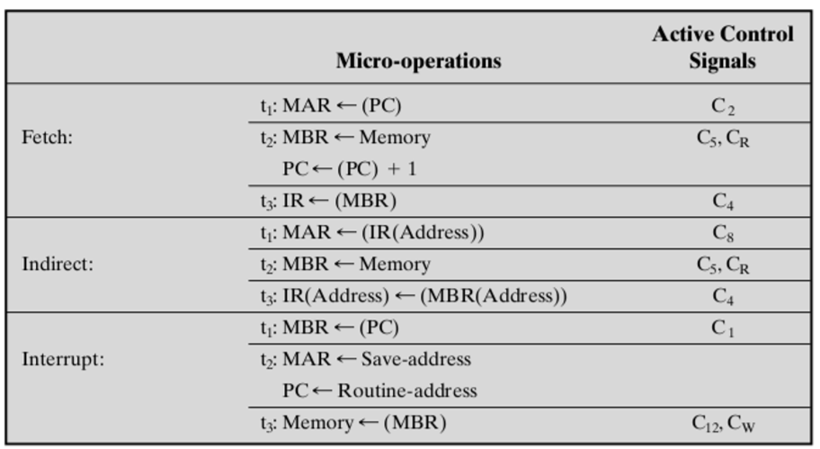

### 3.6.1. Basic Idea 基本思想
1. Consider that for each micro-operation, all that the control unit is allowed to do is generate a set of control signals, to control each control line emanating from the control unit is either on or off 考虑到对于每个微操作，控制单元只允许生成一组控制信号，以控制从控制单元发出的每条控制线是开还是关
2. Each control line is represented by a binary digit 每个控制线都用**二进制数字**表示
3. A control word is constructed in which each bit represents one control line 构造一个控制字，其中每一位表示一条控制线
4. Each micro-operation would be represented by a different pattern of 1s and 0s in the control word 每个微操作在控制字中用不同的1和0表示

5. The sequence of micro-operations is represented by stringing together a sequence of control words 微操作的顺序通过将一系列控制字串在一起来表示
    + 两个操作之间同时肯定不会影响，所以只要同时进行操作就行。
6. For the sequence of micro-operations is not fixed, control words is put in a memory, with each word having a unique address 由于微操作的顺序不是固定的，控制字被放入存储器中，每个字都有一个唯一的地址
    1. Add an address field to each control word, indicating the location of next control word to be executed if a certain condition is true 向每个控制字添加一个地址字段，指示在某个条件为真时要执行的下一个控制字的位置
    2. Add a few bits to specify  the condition 添加一些位以指定条件

### 3.6.2. Microinstruction Interpretation 微操作 中断
1. To execute this microinstruction, turn on all the control lines indicated by a 1 bit; leave off all control lines indicated by a 0 bit 要执行此微指令，请打开由1位指示的所有控制行；关闭由0位指示的所有控制行
2. If the condition indicated by the condition bits is false, execute the next microinstruction in sequence 如果条件位指示的条件为false，则按顺序执行下一条微指令
3. If the condition indicated by the condition bits is true, the next microinstruction to be executed is indicated in the address field 如果条件位指示的条件为真，则在地址字段中指示要执行的下一条微指令

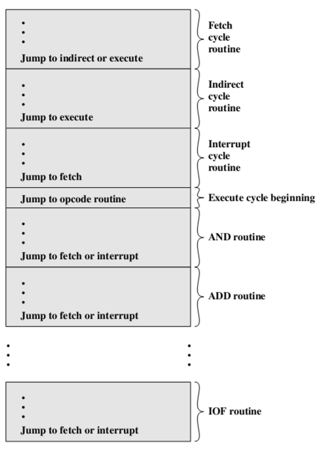

4. 即将跳转的状态会被提前在下面写好。
    + 然后直接执行，首先判断是那种操作码，然后跳到对应的操作码，进行跳转，跳转后处理当前条件下的操作码。
    + 不怕我做不完，只要我能够记录完整就行，存储到Control memory中，每次就拷贝到Control buffer register中去

### 3.6.3. Microprogrammed Control Unit 微编程 控制单元
1. Control memory: Store microinstructions 控制存储器：存储微指令
2. Control address register: Contain the address of the next microinstruction to be read 控制地址寄存器：包含要读取的下一条微指令的地址
3. Sequencing unit: Load the control address register and issue a read command 排序单元：加载控制地址寄存器并发出读取命令

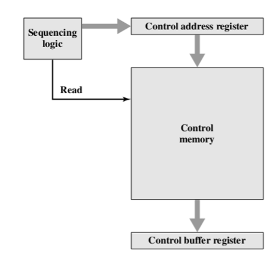

4. When a microinstruction is read from the control memory, it is transferred to a  control buffer register 当从控制存储器读取微指令时，它被传送到控制缓冲寄存器
5. The left-hand portion of that register connects to the control lines emanating from the control unit 该寄存器的左侧部分连接到从控制单元发出的控制线
6. Reading a microinstruction from the control memory is the same as executing that microinstruction 从控制存储器中读取微指令与执行该微指令相同

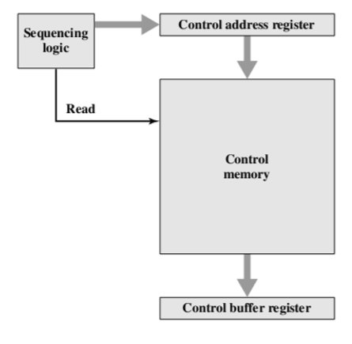

7. Sequencing logic unit issues a READ command to the control memory 顺序逻辑单元向控制存储器发出读取命令
    + 标志位和时钟控制和影响指令的运行
8. The word whose address is specified in control address register is read into control buffer register 在控制地址寄存器中指定地址的字被读入控制缓冲寄存器
9. The content of control buffer register generates control signals and next-address information for sequencing logic unit 控制缓冲寄存器的内容为时序逻辑单元生成控制信号和下一地址信息
10. The sequencing logic unit loads a new address into control address register based on the next address information from control buffer register and ALU flags 排序逻辑单元根据来自控制缓冲寄存器的下一个地址信息和ALU标志将新地址加载到控制地址寄存器中
    + decoder就是通过编码和解码来完成对于指令长度，同时还有IR进行解码

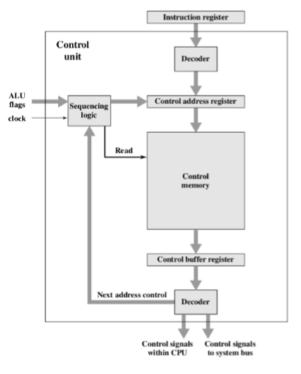

11. Three choices of the last step: 最后一步有三种选择：
    1. Get the next instruction: Add 1 to the control address register 获取下一条指令：将1添加到控制地址寄存器，以便于取得下一条指令
    2. Jump to a new routine based on a jump microinstruction: Load the address field of the control buffer register into the control address register 基于跳转微指令跳转到新例程：将控制缓冲寄存器的地址字段加载到控制地址寄存器中
    3. Jump to a machine instruction routine: Load the control address register based on the opcode in the IR 跳转到机器指令例程：根据IR中的操作码加载控制地址寄存器

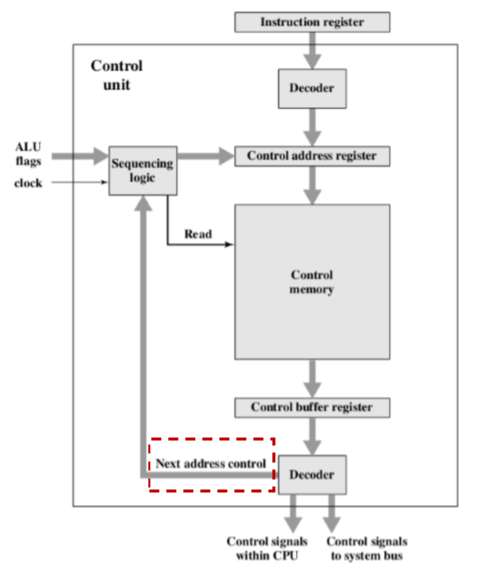

12. Upper decoder: translate the opcode of IR into a control memory address 上解码器：将IR转换成控制存储器地址
13. Lower decoder: not used for horizontal microinstructions but is used for  vertical microinstructions 下解码器：不用于水平微指令，但用于垂直微指令

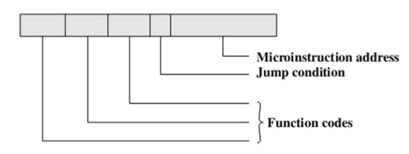
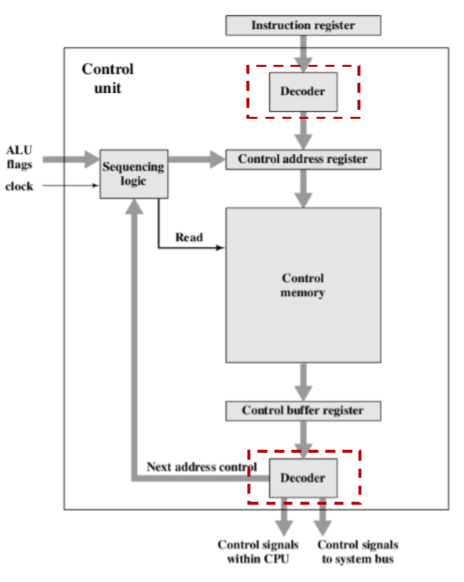

### 3.6.4. Adventages and Disadventages 和硬连线比较
1. Advantages 优点
    1. Simplify the design of the control unit 简化控制单元的设计
    2. It is both cheaper and less error prone to implement 它既便宜又不易出错
2. Disadvantages 缺点
    1. somewhat slower than a hardwired unit of comparable technology 比同类技术的硬接线单元稍慢

## 3.7. Task of Microprogrammed Control Unit 微编程控制单元的任务
1. Microinstruction sequencing: Get the next microinstruction from the control memory 微指令排序：从控制存储器中获取下一个微指令
2. Microinstruction execution: Generate the control signals needed to execute the microinstruction 微指令执行：生成执行微指令所需的控制信号
3. 微指令:控制字 + 条件 + 立即数
    + 将微指令排入到微指令寄存器中
4. 跳转方式:
    1. 根据操作码来确定如何进行跳转
    2. 根据微指令后面的数来进行跳转
    3. 根据条件进行跳转(存疑)

## 3.8. Microinstruction Sequencing 未讲
1. Design considerations 设计注意事项
    1. Size of microinstruction: minimizing the size of the control memory reduces the cost of that component 微型指令大小：最小化控制存储器大小降低了该组件的成本
2. Sequencing technique 测序技术
    1. Based on the current microinstruction, condition flags, and the contents of the instruction register, a control memory address must be generated for the next microinstruction 基于当前微指令、条件标志和指令寄存器的内容，必须为下一个微指令生成一个控制内存地址

## 3.9. Category 类别
1.  Two address fields 两个地址字段
    1. Provide two address fields in each microinstruction 在每个微指令中提供两个地址字段
    2. Based on an address-selection input, the multiplexer transmits either the opcode or one of the two addresses to the control address register 基于地址选择输入，多路复用器将操作码或两个地址中的一个发送到控制地址寄存器

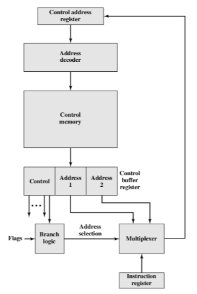

2. Single address field 单一地址字段
    + The address-selection signals determine which option is selected 地址选择信号决定选择哪个选项

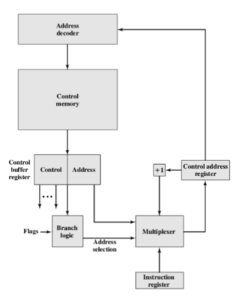

3. Variable format 变量格式
    + Provide two entirely different microinstruction formats, and use one bit to designate which format is being used 提供两种完全不同的微指令格式，并使用一位指定使用哪种格式

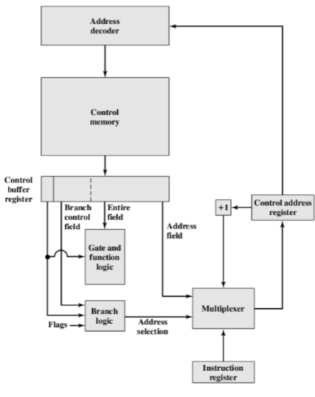

## 3.10. Address generation
1. Explicit 明确的
    1. Two-field 两个领域
    2. Unconditional branch 无条件转移
    3. Conditional branch 有条件转移
2. Implicit 内含的
    1. Mapping 映射
    2. Addition 补充
    3. Residual control 剩余控制

# 4. Microinstruction Execution
1. The effect of the execution of a microinstruction is to generate control signals 微指令执行的效果是产生控制信号
    1. Some of these signals control points internal to the processor 其中一些信号控制点位于处理器内部
    2. The remaining signals go to the external control bus or other external interface 其余信号进入外部控制总线或其他外部接口
2. As an incidental function, the address of the next microinstruction is determined 作为附带功能，下一条微指令的地址被确定
